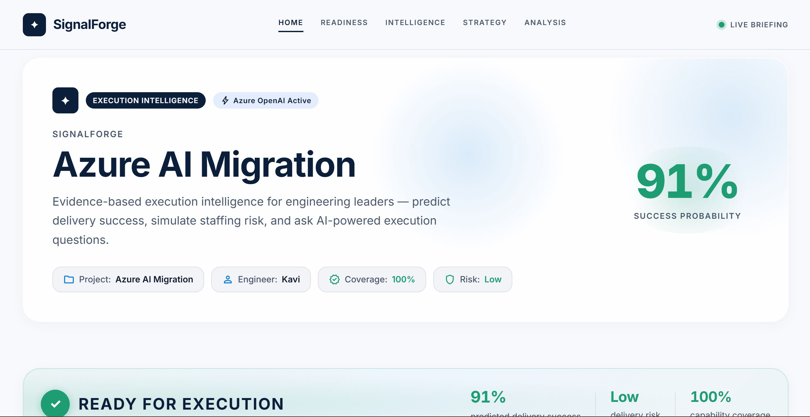
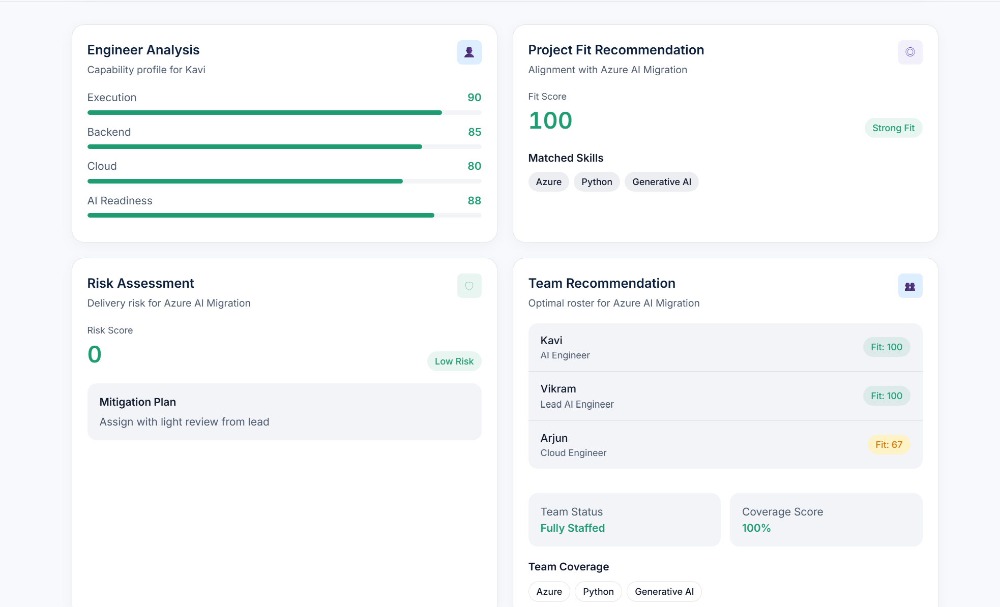
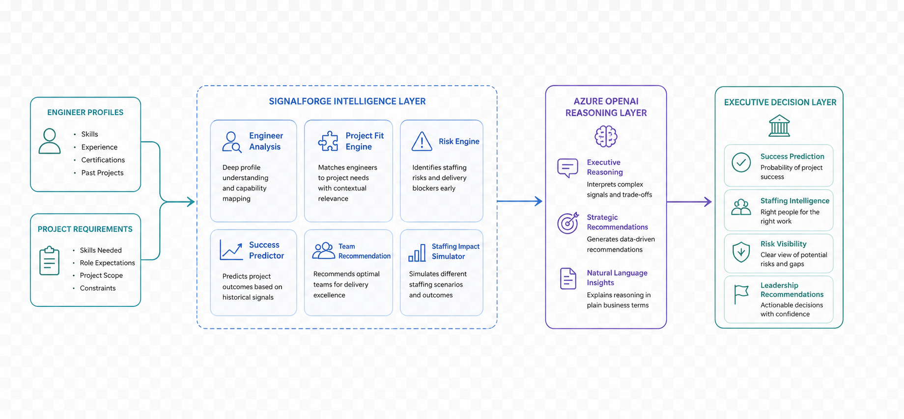
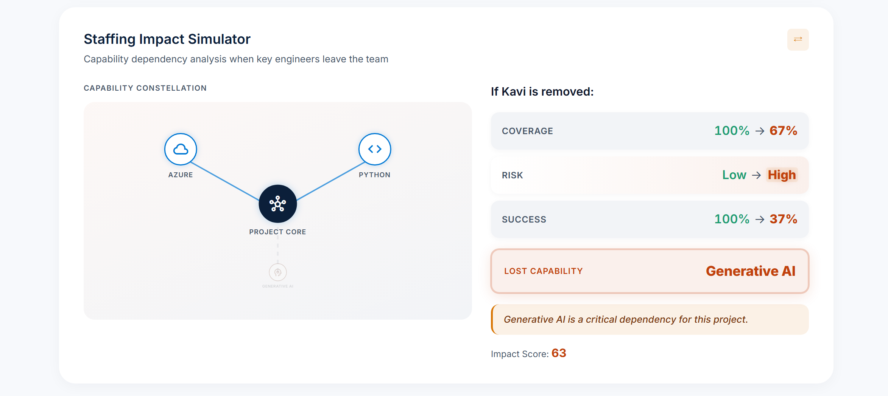
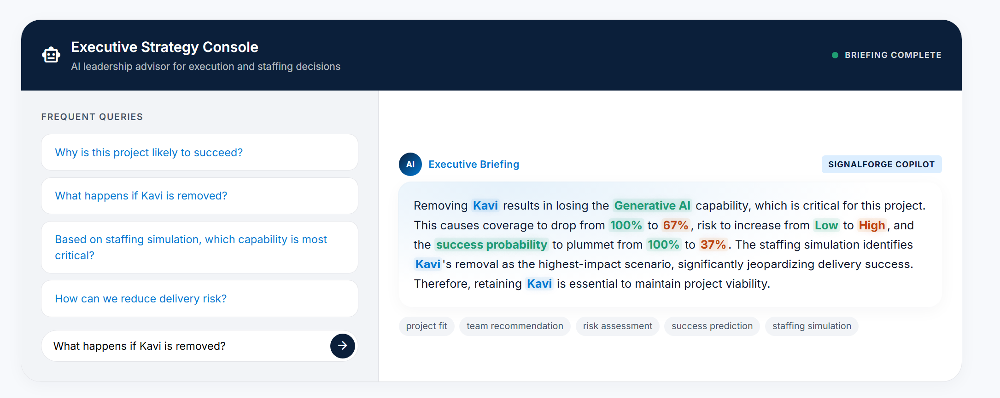
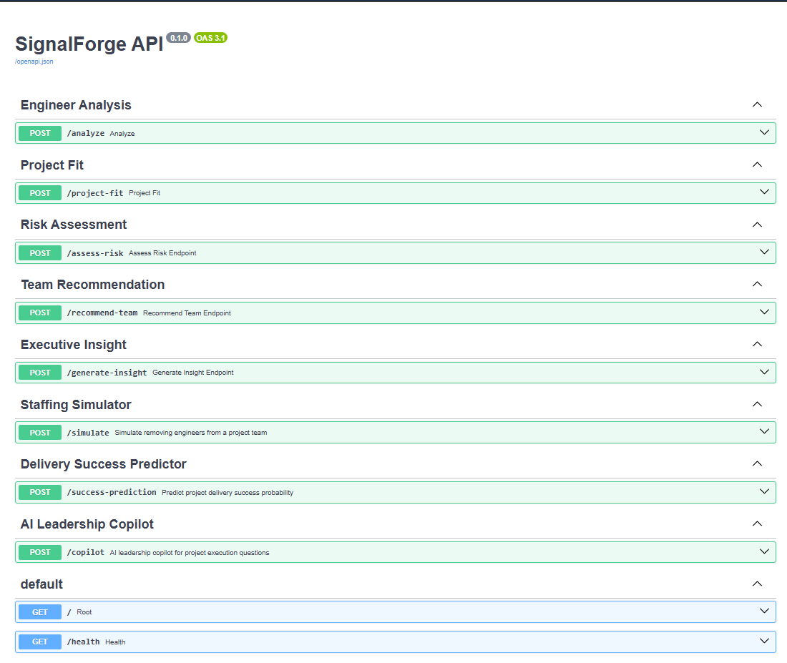

# SignalForge

**AI-powered Engineering Execution Intelligence**

SignalForge helps engineering leaders staff projects with confidence by turning real engineering evidence like profiles, certifications, GitHub activity, PR summaries, and architecture notes into explainable execution intelligence. Instead of relying on self-reported skill matrices, SignalForge infers what engineers can actually deliver and surfaces fit, risk, and team recommendations in a demo-ready dashboard.

Built for the **Microsoft Build AI Hackathon 2026**.

---

## Problem

Engineering managers often lack a reliable way to match engineers to high-stakes initiatives. Resumes and self-assessments do not reveal execution readiness for complex work such as cloud migrations, platform modernization, or AI adoption.

## Solution

SignalForge analyzes structured engineering evidence and produces:

- **Execution and capability scores** (backend, cloud, AI readiness)
- **Project fit recommendations** for a target initiative
- **Risk assessment** with explainable strengths and gaps
- **Team composition guidance** for delivery planning
- **Staffing impact simulation** to compare before/after scenarios
- **SignalForge Copilot** for natural-language queries over execution intelligence
- **REST API** with interactive Swagger documentation

### Demo scenario

An engineering manager needs to staff an **Azure AI migration** project. SignalForge evaluates candidate engineers, highlights the best fit, flags delivery risks, and recommends a team—backed by evidence rather than guesswork.

---

## Screenshots



### Dashboard

The executive dashboard summarizes delivery readiness, capability breakdown, project fit, risk, and team recommendations in one view.



### Architecture

SignalForge combines a Next.js frontend, FastAPI backend, and Azure OpenAI to turn evidence into actionable execution intelligence.



### Staffing Impact Simulator

Compare staffing decisions side by side to understand how team changes affect delivery outcomes.



### SignalForge Copilot

Ask questions in natural language and explore analysis, recommendations, and insights through the copilot console.



### API Documentation

Explore and test SignalForge endpoints through auto-generated Swagger docs.



---

## Tech stack

| Layer | Technologies |
|-------|--------------|
| Frontend | Next.js, TypeScript, Tailwind CSS, shadcn/ui |
| Backend | FastAPI, Python, Pydantic |
| AI | Azure OpenAI |

---

## Repository structure

```
SignalForge/
├── assets/          # Project screenshots (see assets/README.md)
├── backend/         # FastAPI API and services
├── frontend/        # Next.js dashboard
├── architecture/    # System design and MVP scope
└── sample-data/     # Demo engineer profiles
```

---

## Getting started

### Backend

```bash
cd backend
pip install -r requirements.txt
uvicorn app.main:app --reload
```

### Frontend

```bash
cd frontend
npm install
npm run dev
```

Configure Azure OpenAI credentials in your local environment before running AI-powered features. See backend configuration for required settings.

---

## Hackathon highlights

- **Evidence-based execution intelligence** — scores and recommendations grounded in structured engineering signals
- **Explainable AI** — clear strengths, risks, and fit rationale for judges and stakeholders
- **End-to-end demo flow** — dashboard, simulator, copilot, and API in a cohesive MVP
- **Azure AI integration** — Azure OpenAI powers analysis, insights, and the copilot experience

---

## License

See repository license terms for usage details.
