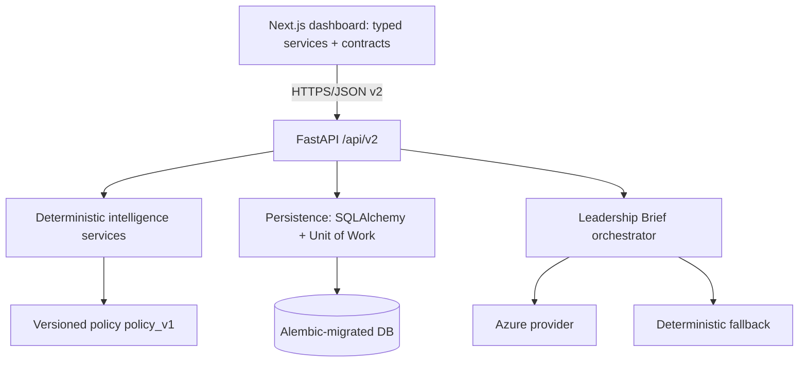
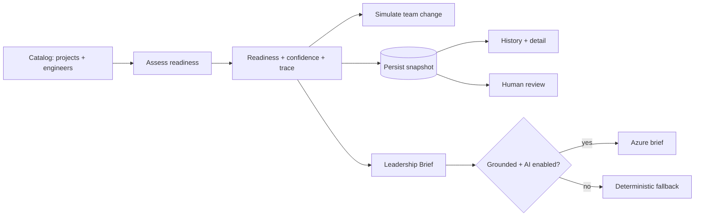

# SignalForge

**Predict. Simulate. Deliver.**

SignalForge turns engineering capability and project requirements into an
explainable delivery-readiness decision — with team simulation, immutable
history, human review, and grounded leadership communication.

> **Category: Engineering Execution Intelligence.**

This README separates what is **IMPLEMENTED** today from what is **PLANNED** for
Phase 3. Every command and path below was verified against the current working
tree (Python 3.13.7 · Node.js 22.19.0 · npm 11.18.0).

---

## 5. Problem

Engineering leaders make high-stakes delivery decisions from fragmented signals —
resumes, skill inventories, spreadsheets and intuition. A project can look
healthy on paper while hiding key-person risk, thin capability coverage, or low
delivery confidence that only surfaces after someone leaves. The core question
often goes unanswered with evidence:

> **Can this team actually deliver this initiative?**

## 6. Target Users

Engineering delivery leaders and their staff: VP/Director of Engineering,
delivery/program managers, and engineering chiefs of staff.

## 7. Buyer & ICP

Software organizations, consultancies and cloud/AI transformation teams where an
engineering leader owns delivery outcomes across multiple initiatives and teams.

## 8. Product Workflow

1. Pick a project (initiative) and a candidate team.
2. Run a readiness assessment → get **readiness** and **confidence** separately.
3. Inspect gaps, ownership concentration and the decision trace.
4. Simulate team changes (add / remove / replace / compare) and see the delta.
5. Persist the assessment; add a human review.
6. Generate a grounded Leadership Brief.
7. Review history and audit trail.

---

## 9. Implemented Capabilities

- Deterministic readiness + confidence scoring (versioned policy).
- Capability coverage, skill-gap and key-person-risk analysis.
- Decision traces (explainability) for every score.
- Team simulation: add / remove / replace / compare with deltas + mitigations.
- Immutable persistence of assessments and simulations, with history + detail.
- Human review (accepted / overridden / needs-more-data) that never rewrites
  scores.
- Grounded Leadership Briefs with strict grounding validation and a deterministic
  fallback (with explicit provenance).
- Typed Next.js frontend wired to the live v2 API.
- Quality + automation: Ruff, pytest, Vitest, Playwright E2E, GitHub Actions CI.

## 9a. Implemented — Phase 3 Prompt 1 (Enterprise Data Foundation)

- Tenant-scoped enterprise domain (20 foundational entities: organization
  hierarchy, engineer profiles, capability/skill catalog, initiatives/projects,
  delivery entities, dependencies/ownership/availability, and a provenance/
  evidence model) with strictly-typed domain DTOs and no ORM leakage.
- Shared-schema multi-tenancy via an explicit `TenantContext`: tenant-qualified
  reads/writes/updates, tenant-scoped composite uniqueness, cross-tenant
  rejection, and non-disclosure of cross-tenant existence (data boundary only —
  **not** authentication).
- Append-only `EvidenceSignal` provenance with canonical SHA-256 hashing and
  deterministic deduplication; `DataSource`/`IngestionRun` foundations with
  **no** external connector calls and **no** plaintext secrets.
- Additive Alembic revision `p3_enterprise_foundation` (one head) that adds a
  nullable `tenant_id` to Phase 2 tables and backfills a `legacy-default` tenant;
  Phase 2 data, snapshots and scores are never rewritten.
- Deterministic, idempotent **NovaBank** demo tenant (233 rows; second run = 0).
- Additive `/api/v3` enterprise routes behind an `X-SignalForge-Tenant-ID`
  header (local dev only), leaving all v2 contracts unchanged.

See
[`architecture/phase-3-enterprise-data-foundation.md`](architecture/phase-3-enterprise-data-foundation.md).
Authentication, RBAC, Entra ID, PostgreSQL row-level security, and production
multi-tenancy remain **deferred**. Delivery prediction is implemented in
Prompt 4 (see §9d).

## 9b. Implemented — Phase 3 Prompt 2 (Connector Ingestion Foundation)

- Provider-neutral connector SDK (protocol, registry, credentials, retry,
  config validation, error taxonomy) with HTTP / normalize / orchestrate /
  persist separation.
- One complete **GitHub REST polling** connector (repository, pull requests,
  reviews, issues, releases) with public unauthenticated mode, Link-header
  pagination, bounded retries, rate-limit handling and SSRF-resistant host
  checks. **Webhooks and OAuth are not implemented.**
- Normalized snapshot events → `EvidenceSignal` + append-only
  `IngestionReceipt` (repeated observations remain auditable after dedup) +
  per-stream `ConnectorCheckpoint` + `IngestionDeadLetter` with manual replay.
- Domain projections for repositories, work items and first-class pull
  requests; releases/reviews remain evidence-first. Manual data is protected by
  source precedence.
- Additive Alembic revision `p3_connector_ingestion_foundation` (single head).
- Local CLI (`python -m app.connectors`) and read-only `/api/v3` connector
  observation routes. **No** public sync-trigger endpoint and **no** credential
  exposure to the frontend.
- Jira / Azure DevOps: staged descriptors + config contracts only
  (`connector_not_implemented` — no false success).

See
[`architecture/phase-3-connector-ingestion-foundation.md`](architecture/phase-3-connector-ingestion-foundation.md).

## 9c. Implemented — Phase 3 Prompt 3 (Delivery Graph)

- Relational, tenant-scoped Delivery Graph projections (`ent_delivery_graph_*`,
  projection/analysis runs, findings) — **no graph database**.
- Deterministic full rebuild (durable rebuild lock), incremental edge refresh
  with inclusive high-watermark overlap, and bounded subject refresh; temporal
  edges retain closed historical snapshots; re-projection is idempotent.
- Bounded query service: neighbors, shortest path, reachability, blast radius,
  dependency cycles, ownership concentration, active-at-time.
- Deterministic graph findings (concentration, single-person dependency,
  cross-team / derived-unmodeled dependencies, cycles, availability blast
  radius, knowledge concentration) with evidence references and reconciliation.
- Read-only `/api/v3/delivery-graph/*` routes and local CLI
  (`python -m app.graph`). Graph confidence is **rule-based**, not calibrated,
  and is distinct from Phase 2 assessment confidence.
- NovaBank graph scenarios (fraud concentration, payment↔platform path, Azure
  capability bottleneck, incident blast radius, demo cycle).

See
[`architecture/phase-3-delivery-graph.md`](architecture/phase-3-delivery-graph.md).
Authentication, RBAC, Entra ID, PostgreSQL RLS, LLM graph queries and
production multi-tenancy remain **deferred**. Calibrated delivery prediction
is implemented in Prompt 4 (see §9d); graph confidence remains rule-based and
is not a delivery probability.

## 9d. Implemented — Phase 3 Prompt 4 (Delivery Prediction Engine)

- Target `DELIVERY_SUCCESS_WITHIN_HORIZON` for projects/initiatives with
  horizons `{30, 60, 90, 180}` (default **90**) and label version
  `delivery_success_label_v1` (unknown/censored stay unlabeled).
- Feature schema `delivery_features_v1` (~53 features across readiness, graph,
  ownership, workflow, data-quality, and project-context families) with
  as-of snapshots, lineage, and leakage rejection.
- Temporal datasets (`temporal_60_20_20_grouped`), pure-Python
  `logistic_delivery_v1` + Platt calibration, deterministic
  `delivery_scorecard_v1` fallback (**uncalibrated score**, not a probability),
  and `insufficient_data` when critical features are missing.
- Model registry with `demo_gates_v1` (Brier primary), backtesting harness,
  deterministic explanations (no LLM), tenant-scoped training
  (`tenant_count=1`), and NovaBank synthetic outcome seed
  (`production_eligible=false` — synthetic metrics ≠ real-world accuracy).
  On NovaBank synthetic data the candidate **fails** `demo_gates_v1` (ECE)
  and remains **unpromoted**; inference uses the uncalibrated scorecard
  fallback (not a probability) until a validated active model exists.
- Read-only `/api/v3/predictions/*` and local CLI (`python -m app.prediction`).
  Predictions are decision-support, not guarantees. Employee-performance
  prediction is **not** implemented. No public train/promote HTTP endpoints.

See
[`architecture/phase-3-delivery-prediction.md`](architecture/phase-3-delivery-prediction.md).
Authentication, RBAC, Entra ID, PostgreSQL RLS, and production multi-tenancy
remain **deferred**. Continuous scenarios are implemented in Prompt 5 (see §9e).

## 9e. Implemented — Phase 3 Prompt 5 (Continuous Scenario Intelligence)

- Immutable scenario definitions/versions with bounded assumption validation
  (eight kinds including combined; no LLM scenario agent).
- Overlay-only execution: baseline vs simulated graph + feature overlays never
  mutate enterprise, graph, evidence, models, or historical prediction rows.
  Baseline capture may materialize deterministic Prompt 4 feature snapshots
  (same extractor path; existing snapshot contents unchanged).
  Scenario feature overlays are always `training_eligible=false`.
- Prediction integration preserves Prompt 4 gates: rejected/candidate models
  are ignored; NovaBank normally uses `uncalibrated_score` fallback (not a
  probability). Estimate comparability prevents mixing scores with probabilities.
- Watches + target-scoped source fingerprints + trigger events for change-driven
  re-evaluation (minimum 60-minute interval; no queues/workers/real-time claims).
  Wall-clock `as_of` drift alone does not re-trigger watches.
- Read-only `/api/v3/scenarios/*` and local CLI (`python -m app.scenarios`).
  Mutation/execution remain CLI/service-only.
- Deterministic NovaBank demo scenarios (8) with idempotent seed.
- Bounded large-graph overlay harness (500 nodes / 2,000 edges) asserts traversal
  and impact budgets; live PostgreSQL remains deferred.

See
[`architecture/phase-3-continuous-scenario-intelligence.md`](architecture/phase-3-continuous-scenario-intelligence.md).

## 9f. Implemented — Phase 3 Prompt 6 (AI Chief of Staff)

- Bounded, auditable executive briefs over five intents (`delivery_status_brief`,
  `change_since_last_review`, `scenario_comparison_brief`,
  `delivery_prediction_brief`, `evidence_gap_brief`) for project/initiative
  targets.
- Temporal, tenant-qualified evidence packages with canonical hashing, claims,
  citations, append-only reviews, and deterministic fallback.
- Reads immutable Prompt 1–5 outputs; does not recalculate readiness, graph
  findings, predictions, or scenario impacts. When a cutoff-valid Phase 2
  assessment exists (via `legacy_project_id`), readiness and assessment
  confidence are included as evidence; otherwise the package states they are
  unavailable.
- Grounding is structured (support matrix, citations, estimate semantics,
  decision-option allowlist) plus phrase scanners — not full NL entailment.
- Read-only `/api/v3/chief-of-staff/*`; generation/review remain CLI/service-only
  (`python -m app.chief_of_staff`) because the tenant header is not authentication.
- NovaBank retains `uncalibrated_score` semantics; no model promotion for demos.

See [`architecture/phase-3-ai-chief-of-staff.md`](architecture/phase-3-ai-chief-of-staff.md).
Auth/RBAC/Entra/RLS (Prompt 7), observability export (Prompt 8), and larger
NovaBank scale remain **deferred**.

## 10. Planned Capabilities (Phase 3)

- Jira / Azure DevOps **HTTP** connectors, GitHub webhooks/OAuth/Apps,
  production multi-tenancy, auth/RBAC, Entra ID, secret
  vault, production observability. Demo-scoped calibrated delivery prediction
  is implemented (Prompt 4); continuous scenario intelligence is implemented
  (Prompt 5); AI Chief of Staff is implemented (Prompt 6). Production-eligible
  customer models remain ahead. See
  [`architecture/phase-3-enterprise-product-roadmap.md`](architecture/phase-3-enterprise-product-roadmap.md).

## 11. Deterministic Intelligence

Readiness and confidence are computed from a versioned policy (`policy_v1`) and
are fully reproducible. **AI never changes scores.**

## 12. Readiness versus Confidence

- **Readiness** — can this team deliver this initiative (capability match)?
- **Confidence** — how sure is SignalForge in that readiness signal (evidence
  strength)?

They are distinct scores and are never conflated.

## 13. Team Simulation

Simulate `add`, `remove`, `replace`, or `compare` operations. Each returns
readiness/confidence deltas, newly introduced/resolved gaps, and recommended
mitigations. Simulations run compute-only or are explicitly persisted.

## 14. Decision Traces

Every assessment returns a structured decision trace explaining how the score was
derived — no black box.

## 15. Persistence and History

Assessments and simulations are stored as immutable snapshots with input/result
hashes. History and detail endpoints return persisted snapshots, not recomputed
values.

## 16. Human Review

Leaders record judgment (accepted / overridden / needs-more-data). Overrides
require a reason; needs-more-data requires a comment. Reviews never modify the
deterministic scores.

## 17. Leadership Briefs

A leadership-ready narrative grounded in the deterministic evidence package,
with brief history per assessment.

## 18. AI Reasoning Boundary

AI is an advisory communication layer only. The brief is grounded and validated;
if grounding fails, output is malformed, or AI is disabled, the deterministic
fallback is used.

## 19. Deterministic Fallback

The fallback provider always produces a valid, grounded brief and records
`provider_mode`, `generation_status` and `failure_category` (e.g. `ai_disabled`).

---

## 20. Architecture Diagram



## 21. Data-Flow Diagram



## 22. Data Model

Core persisted entities (SQLAlchemy, Alembic-migrated):

- `assessment` — immutable readiness snapshot (inputs, result, hashes, policy).
- `simulation_record` — immutable simulation snapshot with deltas.
- `human_review` — review state attached to an assessment.
- `leadership_brief` — generated brief with provider/generation metadata.
- audit/event records for traceability.

Catalog entities (projects, engineers, capabilities) are served from an
in-memory mock repository and seeded for demos.

## 23. APIs (v2)

| Method | Path |
| --- | --- |
| GET | `/health`, `/docs`, `/openapi.json` |
| GET | `/api/v2/projects`, `/api/v2/engineers`, `/api/v2/capabilities` |
| GET | `/api/v2/policies/readiness` |
| POST | `/api/v2/readiness/assess` (compute-only) |
| POST/GET | `/api/v2/assessments`, `GET /api/v2/assessments/{id}` |
| POST | `/api/v2/assessments/{id}/reviews` |
| POST/GET | `/api/v2/assessments/{id}/leadership-brief(s)` |
| POST/GET | `/api/v2/simulations`, `/api/v2/simulation-records`, `GET .../{id}` |

Legacy v1 routes remain mounted for backward compatibility.

Phase 3 adds **additive** `/api/v3` enterprise-foundation routes (organization
hierarchy, engineer profiles, capabilities, initiatives, projects, repositories,
data sources, ingestion runs, evidence signals, and a demo-tenant summary),
gated by a local-only `X-SignalForge-Tenant-ID` header. v2 contracts are
unchanged.

## 24. Demo Scenarios

Seeded scenarios include readiness and simulation cases such as
`critical_engineer_exit` and `balanced_team`. See
[`architecture/phase-2-demo-scripts.md`](architecture/phase-2-demo-scripts.md).

## 25. Frontend Workflow

Typed API client → per-resource services/contracts → dashboard views (catalog
selection, assessment, history, review dialog, simulation panel, Leadership Brief
panel), with async-state handling and Vitest tests.

## 26. Screenshots / GIFs

_Placeholders — to be captured against the v2 dashboard:_

- `` — catalog + assessment view.
- `` — separated scores.
- `` — remove-engineer delta.
- `` — grounded brief + provenance.

---

## 27. Local Setup

```bash
git clone https://github.com/RPK2103/SignalForge.git
cd SignalForge

# Backend
cd backend
python -m venv .venv
# Windows: .venv\Scripts\activate   |  macOS/Linux: source .venv/bin/activate
pip install -r requirements.txt
pip install -r requirements-dev.txt   # Ruff, pip-audit (dev only)

# Frontend
cd ../frontend
npm ci
```

## 28. Environment Variables

Backend (`backend/.env`, see `backend/.env.example`):

```env
APP_ENV=development
LOG_LEVEL=INFO
DATABASE_URL=sqlite:///./signalforge.db
CORS_ORIGINS=http://localhost:3000,http://127.0.0.1:3000
AI_ENABLED=false            # keep AI off for local/E2E; uses deterministic fallback
# AZURE_OPENAI_* only needed for live AI briefs
```

`CORS_ORIGINS` accepts a comma-separated list, a JSON array string, `*`, or a
single origin.

Frontend (`frontend/.env.local`, see `frontend/.env.example`):

```env
NEXT_PUBLIC_SIGNALFORGE_API_BASE_URL=http://127.0.0.1:8000
```

## 29. Migration

```bash
cd backend
python -m alembic upgrade head
python -m alembic current
python -m alembic check
```

Single head: `p3_connector_ingestion_foundation` (down-revision
`p3_enterprise_foundation`). Downgrade with
`python -m alembic downgrade p3_enterprise_foundation` (validated on disposable
SQLite; do not downgrade a long-lived DB without a backup).

## 30. Seed Command

```bash
cd backend
python -m app.db.seed
```

Idempotent: first run seeds `capabilities=11, engineers=3, projects=5,
scenarios=8`; a second run inserts nothing.

The Phase 3 NovaBank enterprise demo tenant is seeded separately and is also
idempotent (first run creates 233 rows across the enterprise entities; a second
run creates 0):

```bash
cd backend
python -m app.db.enterprise_seed
```

## 31. Tests and Exact Verified Results

| Suite | Command | Result |
| --- | --- | --- |
| Backend | `python -m pytest tests -q` | **323 passed, 1 warning** |
| Backend format | `python -m ruff format --check app tests` | 161 files already formatted |
| Backend lint | `python -m ruff check app tests` | All checks passed! |
| Frontend | `npm run test` | **23 passed** (4 files) |
| Frontend lint | `npm run lint` | clean |
| Frontend types | `npm run typecheck` | clean |
| Frontend build | `npm run build` | Compiled successfully |
| Browser E2E | `npm run test:e2e` | **1 passed** (22-step flow) |

## 32. Browser E2E Status

**IMPLEMENTED.** Playwright (`frontend/playwright.config.ts`, `frontend/e2e/`)
runs a deterministic cross-service test on a disposable SQLite DB with
Alembic migration + explicit seed, `AI_ENABLED=false`, a locally started backend,
and a production frontend build. It drives the full 22-step flow and asserts no
uncaught console errors and no unhandled failed requests. Artifacts (reports,
traces, videos, screenshots) are git-ignored.

## 33. CI Workflows

`.github/workflows/`: `backend-ci.yml`, `frontend-ci.yml`, `e2e-ci.yml`,
`security-ci.yml`. All use `permissions: contents: read`, explicit timeouts,
concurrency cancellation, trigger on PR + push-to-main + manual dispatch, and use
no secrets, no Azure and no production database. **The first remote run is
pending until pushed.**

## 34. Deployment

Backend deploys to **Render** (`render.yaml`): rootDir `backend`, build
`pip install -r requirements.txt`, start
`uvicorn app.main:app --host 0.0.0.0 --port $PORT`, health path `/health`,
Python 3.13, Azure vars `sync:false`. Run `alembic upgrade head` then
`python -m app.db.seed` on release. Rollback: redeploy the previous commit;
schema rollback via `alembic downgrade -1` (with a backup). No frontend
deployment configuration is committed yet.

## 35. Public Deployment Status

**DEPLOYMENT CONFIGURATION VALIDATED; PUBLIC FLOW DEFERRED.** No live public URL
was tested in this release pass. Public deployment success is **not** claimed.

## 36. Security

- Production dependency audits clean: `pip-audit -r backend/requirements.txt`
  (0 known vulns) and `npm audit --omit=dev --audit-level=high` (0 high/critical).
- Secret scanning via gitleaks in CI; working tree + git history contain no real
  secrets, keys, `.env` files or databases (only `*.env.example` templates).
- Remaining advisories are dev/lint-time only and reported informationally.

## 37. Privacy and Employee-Data Considerations

SignalForge analyzes **team and initiative delivery capability**, not individuals.
Current data is entirely synthetic. It explicitly prohibits profile scraping,
email collection, unauthorized chat ingestion and sensitive-attribute inference.
See
[`architecture/phase-3-realistic-data-strategy.md`](architecture/phase-3-realistic-data-strategy.md).

## 38. Limitations

- Synthetic catalog/identities (toy seed IDs), not real customer data.
- Deterministic Phase 2 policy scores remain distinct from Prompt 4 calibrated
  delivery probabilities; readiness / assessment confidence / graph confidence
  are never redefined as probability.
- Demo prediction uses synthetic NovaBank outcomes
  (`production_eligible=false`); synthetic metrics ≠ real-world accuracy.
- GitHub polling is implemented; GitHub webhooks/OAuth/Apps are not.
- Jira and Azure DevOps HTTP connectors are not implemented (staged contracts only).
- Tenant header is a data boundary only — not authentication, RBAC or Entra ID.
- Secret vault, queues/distributed workers, and continuous scenarios
  (Prompt 5) remain deferred.
- Delivery graph relational projection is implemented; graph DB / LLM graph
  queries are not.
- Live PostgreSQL and live Azure OpenAI not validated in this pass.

## 39. Phase 3 Roadmap

Numbered from Prompt 1 in
[`architecture/phase-3-enterprise-product-roadmap.md`](architecture/phase-3-enterprise-product-roadmap.md):
domain foundation → connectors → delivery graph → prediction → continuous
scenarios → AI Chief of Staff → security/scale → observability → realistic tenant
→ POC/pitch.

## 40. Hackathon Origin

SignalForge began as a solo hackathon MVP (v1) — a FastAPI backend with a
vanilla dashboard and Azure OpenAI copilot over synthetic data. Phase 2
re-architected it into a deterministic, tested, persisted, typed and CI-covered
release candidate.

## 41. Portfolio Relevance

Demonstrates product thinking (a real leadership decision), deterministic +
explainable intelligence, a clean FastAPI/Next.js architecture, and full
engineering hygiene: migrations, tests, browser E2E, CI, security auditing and
honest documentation of what is implemented versus planned.

---

_Further reading:
[`architecture/phase-2-completion-report.md`](architecture/phase-2-completion-report.md) ·
[`architecture/phase-2-microsoft-poc-and-startup-readiness.md`](architecture/phase-2-microsoft-poc-and-startup-readiness.md) ·
[`architecture/phase-2-demo-scripts.md`](architecture/phase-2-demo-scripts.md)._
