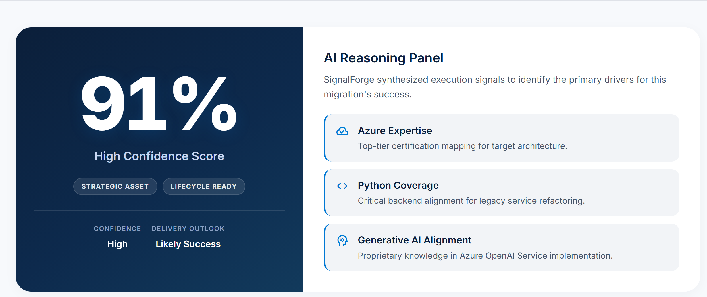

# SignalForge

**Predict. Simulate. Deliver.**

AI-powered engineering execution intelligence for leaders who need to know whether a team and initiative can realistically deliver — before execution risk becomes a delivery failure.

| | |
|---|---|
| **Live Demo** | [signalforge-o0m4.onrender.com/dashboard](https://signalforge-o0m4.onrender.com/dashboard/) |
| **API** | [signalforge-o0m4.onrender.com](https://signalforge-o0m4.onrender.com) |
| **Swagger** | [signalforge-o0m4.onrender.com/docs](https://signalforge-o0m4.onrender.com/docs) |


## Why SignalForge?

Engineering leaders often see delivery risk only after a project is already in motion.

The signals that matter are usually scattered — across repositories, work items, delivery systems, incidents, capability knowledge, project dependencies, and ownership structures. Status decks and spreadsheets can make an initiative look healthy while capability gaps, concentrated ownership, or a fragile dependency remain invisible.

SignalForge brings those signals together so teams can spot delivery risk earlier, explore interventions, and decide with clearer evidence before problems become expensive.

It evaluates delivery-system risk. It is not employee surveillance, performance ranking, hiring automation, or automated employment decision-making.

---

## What SignalForge Does

### Delivery Readiness

Assess capability coverage, project fit, and execution readiness — with readiness and confidence treated as separate signals.

### Engineering Evidence

Normalize engineering evidence into a tenant-scoped evidence model with provenance, so recommendations can be traced back to sources.

### Delivery Graph

Connect teams, projects, repositories, dependencies, work items, incidents, and ownership relationships into a navigable delivery graph.

### Scenario Intelligence

Explore decision-support simulations such as dependency slips, capability shortages, ownership concentration, and critical-resource availability changes. Scenarios are overlays for leadership reasoning — not causal predictions.

### AI Chief of Staff

Generate evidence-grounded engineering leadership briefs with source binding, human review workflows, and deterministic fallback when live AI is unavailable.

### AI Quality & Observability

Track system behavior, evidence quality, AI workflows, and review activity so operators can see how the intelligence layer is behaving.

---

## Product Screens


*Delivery readiness — capability coverage, project fit, risk, and team recommendation in one view.*


*Scenario intelligence — compare before/after impact when critical capacity changes.*


*AI Chief of Staff — evidence-grounded briefing for leadership questions.*



*Explainable reasoning — structured drivers behind a delivery outlook.*

---

## How It Works

```text
Engineering Systems
        ↓
Connector & Evidence Layer
        ↓
Normalized Enterprise Evidence
        ↓
Delivery Graph + Prediction + Scenario Intelligence
        ↓
AI Chief of Staff
        ↓
Human Review + Executive Decision Support
```

Signals enter through connectors and evidence ingestion, land in a normalized tenant-scoped model, and feed the delivery graph, readiness scoring, and scenario overlays. AI synthesizes grounded briefs for leaders; humans review and remain accountable for decisions.

---

## Enterprise & AI Capabilities

SignalForge is built for environments where explainability and isolation matter as much as insight:

- Evidence-grounded AI with citation binding and deterministic fallback
- Delivery graph intelligence over teams, systems, and ownership
- Deterministic scenario simulation for decision support
- Delivery prediction infrastructure with honest estimate labeling (not promoted as a calibrated probability)
- Human review workflows that never silently rewrite scores
- Tenant isolation, JWT authentication, RBAC, and PostgreSQL Row-Level Security
- Auditability, observability, and AI-quality evaluation foundations
- Deterministic test paths that do not require live external LLM access

---

## Microsoft / Enterprise Alignment

SignalForge originated in a Microsoft-focused engineering context and is designed to fit enterprise Microsoft environments.

**In the product today:** optional Azure OpenAI provider support with deterministic fallback, Entra OIDC JWT verification as a configured auth mode, and a GitHub REST polling connector for engineering evidence.

**Designed for / not yet shipped as interactive production integrations:** Microsoft Entra browser login, Azure Container Apps or App Service hosting, Azure Database for PostgreSQL as a production cutover, live Azure OpenAI production operation, Teams, Power BI, Copilot Studio, and Azure Marketplace publishing.

Microsoft has not endorsed this project.

---

## Technology

**Backend:** FastAPI · Python · SQLAlchemy · PostgreSQL · Alembic · Pydantic

**Frontend:** Next.js · React · TypeScript · Tailwind · shadcn/ui

**AI / Intelligence:** Evidence-grounded briefs · Delivery graphs · Scenario simulation · Evaluation workflows · Optional Azure OpenAI

**Engineering:** Pytest · Vitest · Playwright · Ruff · GitHub Actions · Docker

**Security:** JWT · RBAC · PostgreSQL RLS · Tenant isolation · Gitleaks · Dependency auditing

**Ingestion:** GitHub-backed evidence polling (implemented). Jira and Azure DevOps HTTP connectors are not completed.

**Engineering quality (verified baseline):** Backend 997 · Frontend 43 · Playwright 8 · Remote PostgreSQL 24 · Production dependency audits at 0 known vulnerabilities (pip + npm).

---

## Enterprise Demo

**NovaBank is a deterministic synthetic enterprise used to demonstrate SignalForge safely. It is not a customer.**

The demo tenant is sized to feel like a real engineering organization:

- 48 engineers
- 14 initiatives
- 32 repositories
- 1,015 graph nodes / 1,362 graph edges after materialization
- 8 canonical delivery-risk scenarios

It is production-ineligible by design — a controlled dataset for demos, tests, and narrative walkthroughs.

---

## Current Status & Limitations

SignalForge has a strong enterprise architecture and extensive automated validation. Several areas remain intentionally unclaimed:

- NovaBank data is synthetic
- The final enterprise build has not been validated in a real customer production environment
- Microsoft Entra interactive authentication is not yet implemented
- Jira HTTP integration is not yet implemented
- Azure DevOps HTTP integration is not yet fully implemented
- Delivery prediction is not promoted as a calibrated probability model
- Real customer outcome / ROI validation has not been established
- Production-scale performance limits have not been validated

> SignalForge is being developed with a simple principle: intelligence should be explainable, evidence-backed, and useful to human decision-makers.
