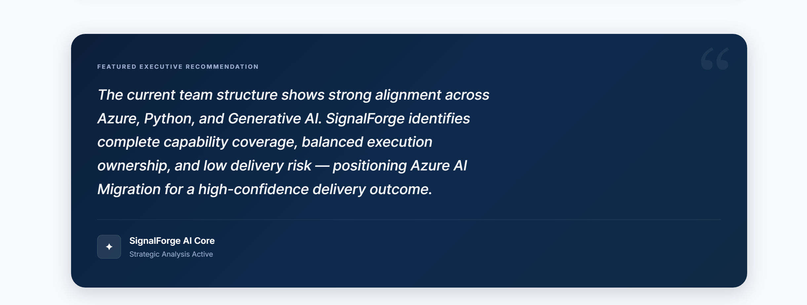
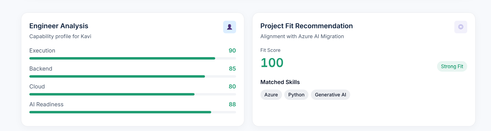
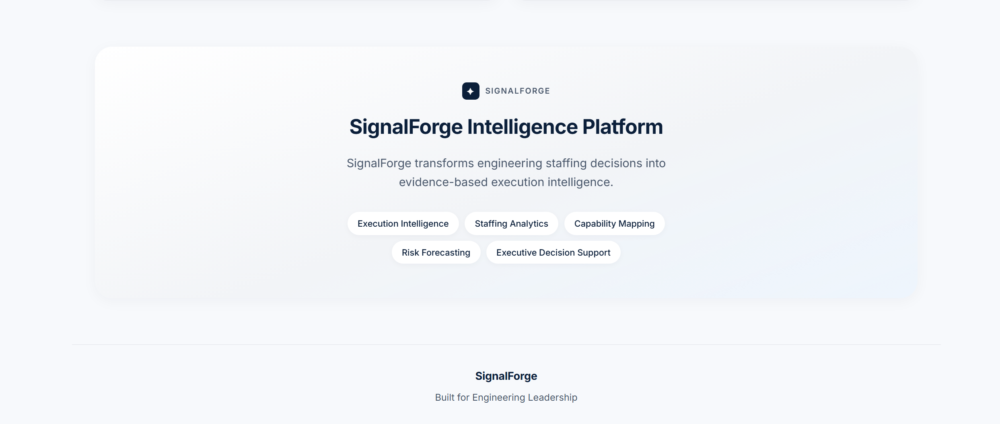

# SignalForge

## AI Execution Intelligence for Engineering Delivery

SignalForge is an AI-powered Engineering Execution Intelligence platform that helps engineering leaders predict project delivery success, identify staffing risks, simulate team changes, and make evidence-based decisions before projects fail.

> **Predict. Simulate. Deliver.**


## Live Project Links

* **Live Dashboard:** https://signalforge-o0m4.onrender.com/dashboard/
* **Backend API:** https://signalforge-o0m4.onrender.com
* **Swagger API Docs:** https://signalforge-o0m4.onrender.com/docs

---

## Why I Built SignalForge

Engineering leaders make high-stakes delivery decisions every day.

But many of those decisions are still made using fragmented information: resumes, skill inventories, project requirements, spreadsheets, and manager intuition.

This creates a blind spot.

A project may look healthy on paper, but still have hidden risks:

* one critical engineer carrying an important capability
* missing cloud or AI readiness
* weak project-fit signals
* low capability coverage
* unclear delivery confidence
* dependency risk that only appears after someone leaves

SignalForge was built to answer one practical question:

> **Can this team actually deliver this project successfully?**

---

## What SignalForge Does

SignalForge converts engineering capability data into execution intelligence.

It helps leaders understand:

* which engineer is the right fit
* which capability is most critical
* how risky a project is
* how confident the team should be in delivery success
* what happens if a key engineer becomes unavailable
* what action leadership should take next

The goal is not just to show data.

The goal is to make delivery risk visible early enough to act on it.

---

## Core Product Themes

### **Execution Intelligence**

SignalForge does not stop at skill matching. It connects engineer capability, project requirements, delivery risk, and staffing impact into one decision view.

### **Explainable AI**

The platform uses transparent scoring and reasoning so leaders can understand why a project is considered low-risk, high-risk, well-covered, or dependent on a specific capability.

### **Human + AI Decision Support**

SignalForge is designed for leadership decisions. It does not replace engineering judgment. It strengthens it with structured signals and AI-powered reasoning.

### **What-If Simulation**

The Staffing Impact Simulator allows leaders to test staffing scenarios before they become real delivery problems.

### **Enterprise Product Thinking**

The MVP is deployed, interactive, API-driven, and designed around real engineering leadership workflows.

---

## Key Features

## 1. Engineer Analysis

SignalForge analyzes an engineer across delivery-relevant dimensions.

Outputs include:

* Execution score
* Backend score
* Cloud score
* AI readiness score
* Capability summary

This helps leaders understand not just what an engineer knows, but how their capability contributes to delivery.

---

## 2. Project Fit Recommendation

SignalForge compares engineer capabilities against project requirements.

Outputs include:

* Fit score
* Matched skills
* Missing skills
* Alignment reasoning

This helps identify whether an engineer is a strong fit for a specific project context.

---

## 3. Risk Assessment

SignalForge evaluates project delivery risk based on skill coverage and capability alignment.

Outputs include:

* Risk score
* Risk level
* Risk reasoning
* Mitigation plan

This gives leaders an early view of possible delivery weaknesses.

---

## 4. Team Recommendation

SignalForge recommends a project team based on required capabilities.

Outputs include:

* Recommended team composition
* Capability coverage
* Skill mapping
* Coverage reasoning

This helps leaders move from manual staffing decisions to evidence-based team formation.

---

## 5. Success Prediction

SignalForge estimates project delivery confidence based on team fit and capability coverage.

Outputs include:

* Success probability
* Confidence score
* Delivery outlook

This gives an executive-level view of whether the current team setup is likely to succeed.

---

## 6. Staffing Impact Simulator

The Staffing Impact Simulator is the core innovation of SignalForge.

It allows leaders to simulate the removal of key engineers and immediately see how the project changes.

Outputs include:

* Capability loss
* Coverage reduction
* Risk increase
* Success probability drop
* Critical dependency identification

Example scenario:

A project initially shows:

* Success probability: 91%
* Coverage: 100%
* Risk: Low

After removing a critical engineer:

* Success probability drops to 37%
* Coverage drops to 67%
* Risk increases to High
* Lost capability: Generative AI

This reveals a hidden dependency before execution begins.

---

## 7. SignalForge Copilot

SignalForge Copilot is an executive AI advisor powered by Azure OpenAI.

Leaders can ask questions such as:

* Why is this project likely to succeed?
* What capability is most critical?
* What happens if a key engineer is removed?
* How can we reduce delivery risk?
* Which staffing decision has the highest impact?

The Copilot reasons over project, staffing, capability, risk, and delivery signals to generate practical recommendations.

---

## AI Integration & Intelligence Design

SignalForge uses a hybrid intelligence architecture.

The platform first converts engineer and project inputs into structured execution signals such as:

* capability coverage
* project fit
* delivery risk
* success probability
* staffing dependency impact

Azure OpenAI is then used as a reasoning layer over these structured signals.

Instead of acting as a generic chatbot, the SignalForge Copilot interprets project context, explains staffing risk, summarizes delivery confidence, and generates strategic recommendations for engineering leaders.

This design keeps the core decision signals explainable while using AI for synthesis, reasoning, and executive decision support.

In simple terms:

> SignalForge uses deterministic intelligence for trust and Azure OpenAI for reasoning.

---

## Architecture Overview

```text
Engineer Profiles + Project Requirements
                 |
                 v
      SignalForge Intelligence Layer
                 |
   -------------------------------------
   | Engineer Analysis Engine          |
   | Project Fit Engine                |
   | Risk Assessment Engine            |
   | Team Recommendation Engine        |
   | Success Prediction Engine         |
   | Staffing Impact Simulator         |
   -------------------------------------
                 |
                 v
        Azure OpenAI Reasoning Layer
                 |
                 v
      Executive Decision Intelligence
                 |
   -------------------------------------
   | Dashboard                         |
   | Copilot                           |
   | Risk Insights                     |
   | Staffing Recommendations          |
   | Delivery Confidence               |
   -------------------------------------
```

---
## Product Walkthrough

A quick visual walkthrough of SignalForge from executive dashboard to AI reasoning, staffing simulation, and API readiness.

---

## SignalForge Overview


SignalForge is designed as an executive intelligence layer for engineering delivery — helping leaders move from intuition-based staffing decisions to evidence-based execution planning.

---

## Dashboard Home


The home view summarizes the active project, core success metrics, staffing coverage, risk level, and AI-enabled execution insights.

---

## AI-Generated Insights



SignalForge converts structured engineering signals into leadership-ready insights, making delivery risks easier to understand and act on.

---

## AI Reasoning Panel


The AI reasoning panel explains why a project is likely to succeed, where the risk exists, and what decision-makers should pay attention to.

---

## Engineer Analysis & Project Fit



SignalForge analyzes engineer capability and compares it against project requirements to generate fit scores and alignment reasoning.

---


## Staffing Impact Simulator


This is the core simulation moment. SignalForge shows how removing a key engineer affects project coverage, delivery risk, and success probability.

---

## SignalForge Copilot


SignalForge Copilot is powered by Azure OpenAI and allows leaders to ask strategic questions about delivery risk, staffing impact, and mitigation plans.

---

## Dashboard Insights


The insights view brings together project signals, capability reasoning, and leadership recommendations in one place.

---

## Architecture


SignalForge follows a hybrid intelligence architecture: explainable scoring engines generate delivery signals, and Azure OpenAI turns those signals into executive reasoning.

---

## Swagger API Documentation


The backend exposes documented FastAPI endpoints through Swagger, making the prototype easy to inspect, test, and extend.

---

## Closing View



SignalForge is built around one core idea:

> **Predict delivery risk. Simulate staffing impact. Deliver with confidence.**

---

## Tech Stack

### Backend

* Python
* FastAPI
* Pydantic v2
* Azure OpenAI
* OpenAI SDK
* REST APIs

### Frontend

* HTML
* CSS
* JavaScript
* Custom executive dashboard
* Interactive simulator
* AI reasoning panels

### Deployment

* Render
* GitHub

---

## Microsoft AI Stack Usage

SignalForge uses the Microsoft AI stack through Azure OpenAI.

Azure OpenAI powers the Copilot experience and enables natural language reasoning over project delivery signals.

The AI layer is used for:

* executive reasoning
* delivery risk explanation
* strategic recommendation generation
* staffing impact interpretation
* natural language decision support

The project demonstrates how Azure OpenAI can be applied beyond generic chat experiences to support enterprise engineering decisions.

---

## API Overview

The backend exposes APIs for the main intelligence workflows.

Main API categories include:

```text
Engineer Analysis
Project Fit Recommendation
Risk Assessment
Team Recommendation
Success Prediction
Staffing Impact Simulation
SignalForge Copilot
```

Swagger documentation is available here:

https://signalforge-o0m4.onrender.com/docs

---

## Example Use Case

Scenario:

An enterprise is planning an Azure AI Migration project.

The project requires:

* Azure
* Python
* Backend engineering
* Generative AI capability

SignalForge analyzes the current team and shows that the project appears healthy.

Initial state:

* Success probability: 91%
* Coverage: 100%
* Risk: Low

Then leadership simulates the removal of a critical engineer.

Updated state:

* Success probability: 37%
* Coverage: 67%
* Risk: High
* Lost capability: Generative AI

This helps leaders identify dependency risk before the project is already in trouble.

---

## Evaluation Criteria Alignment

### AI Integration & Intelligence Design

SignalForge uses Azure OpenAI as a reasoning layer over structured execution signals. The Copilot converts staffing, capability, risk, and delivery data into strategic recommendations.

### System Architecture & Engineering Quality

The application uses a modular FastAPI backend, structured Pydantic models, REST APIs, explainable scoring engines, Azure OpenAI integration, an interactive dashboard, and live deployment.

### Communication, Presentation & UX

The dashboard is designed as an executive command center with clear metrics, reasoning panels, and simulation-first storytelling.

### Prototype Readiness & Scalability

The project is fully deployed with a live dashboard, backend API, Swagger documentation, and public GitHub repository.

### Problem Depth & Product Clarity

SignalForge addresses a real enterprise problem: engineering leaders often lack an evidence-based way to predict delivery risk and staffing impact.

### Market Understanding & Product Fit

The product fits enterprise engineering organizations, consulting firms, AI transformation teams, cloud migration teams, and delivery leadership groups.

---

## Data Privacy

SignalForge uses synthetic demo data only.

No confidential employer data, proprietary project data, sensitive employee information, or personal records are included in this repository.

API keys and secrets are managed through environment variables and are not committed to source control.

---

## Environment Variables

Create a `.env` file or configure environment variables in your deployment platform.

```env
AZURE_OPENAI_API_KEY=your_azure_openai_key
AZURE_OPENAI_ENDPOINT=your_azure_openai_endpoint
AZURE_OPENAI_DEPLOYMENT=your_deployment_name
AZURE_OPENAI_API_VERSION=your_api_version
OPENAI_API_KEY=your_optional_openai_key
```

Never commit real secrets to GitHub.

---

## Local Setup

### 1. Clone the repository

```bash
git clone https://github.com/RPK2103/SignalForge.git
cd SignalForge
```

### 2. Create a virtual environment

```bash
python -m venv venv
```

### 3. Activate the virtual environment

Windows:

```bash
venv\Scripts\activate
```

macOS/Linux:

```bash
source venv/bin/activate
```

### 4. Install dependencies

If the backend dependencies are inside the backend folder:

```bash
cd backend
pip install -r requirements.txt
```

Otherwise:

```bash
pip install -r requirements.txt
```

### 5. Configure environment variables

Create a `.env` file using the environment variable format shown above.

### 6. Run the FastAPI server

```bash
uvicorn app.main:app --reload
```

### 7. Open the app locally

```text
Dashboard: http://127.0.0.1:8000/dashboard/
Swagger:   http://127.0.0.1:8000/docs
```

---

## Repository Structure

```text
SignalForge/
│
├── README.md
├── assets/
│   ├── signalforge-hero.png
│   ├── dashboard-home.png
│   ├── architecture.png
│   ├── staffing-simulator-before-after.png
│   ├── copilot-console.png
│   └── api-docs.png
│
└── backend/
    ├── app/
    │   ├── main.py
    │   ├── routes/
    │   ├── schemas/
    │   ├── services/
    │   └── static/
    │
    └── requirements.txt
```

---

## AI Tools Used

The following AI tools were used during the hackathon development process:

* Azure OpenAI for Copilot reasoning and strategic recommendations
* AI-assisted development tools for coding support, UI iteration, documentation refinement, and demo storytelling

All final product decisions, architecture direction, implementation choices, testing, deployment, and submission materials were reviewed and completed by the participant.

---

## MVP Limitations

This is a hackathon MVP built to demonstrate the core execution intelligence concept.

Current limitations:

* Uses synthetic demo data
* Uses explainable scoring logic rather than trained historical ML models
* Does not yet integrate with enterprise systems such as Azure DevOps, GitHub, Microsoft Graph, Workday, or Teams
* Does not yet include authentication or role-based access control
* Does not yet store organization-wide historical delivery data

These limitations are intentional for the MVP scope and are part of the future roadmap.

---

## Future Roadmap

Planned enhancements include:

* Azure DevOps integration for delivery signals
* GitHub integration for contribution and code activity signals
* Microsoft Graph integration for collaboration and team context
* Workday or HRIS integration for skill and role data
* Historical delivery learning from completed projects
* Organization-wide capability graph
* Agentic staffing recommendations
* Executive briefing generation
* Delivery risk monitoring over time
* Role-based access and enterprise authentication

The long-term vision is to evolve SignalForge into an AI Chief of Staff for Engineering Delivery.

---

## Hackathon Submission Note

SignalForge was designed, built, deployed, and submitted for the Microsoft Build AI Hackathon 2026.

The project was built during the hackathon period and uses open-source frameworks and publicly available APIs where applicable.

This submission demonstrates product thinking, engineering implementation, Microsoft AI stack usage, and human-led creativity in identifying a practical enterprise AI use case.

---

## Team

Solo participant:

**Kaviyashre Ragupathy**

Role:

* Product ideation
* System design
* Backend implementation
* Azure OpenAI integration
* Dashboard design
* Demo storytelling
* Deployment
* Documentation

---

## Closing Thought

Engineering organizations do not fail only because of missing talent.

They fail because leaders cannot see execution risk early enough.

SignalForge makes that risk visible.

**Predict. Simulate. Deliver.**
