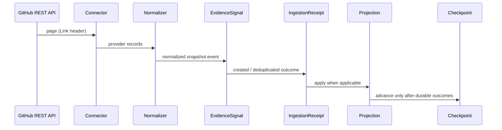

# Phase 3 — Prompt 2: Connector SDK and Evidence Ingestion Foundation

This document describes the connector SDK and GitHub evidence-ingestion pipeline
introduced in Phase 3 Prompt 2. It builds on the Prompt 1 enterprise data
foundation without rewriting immutable Phase 2 or Prompt 1 historical records.

> **Scope honesty.** GitHub **polling** is implemented. GitHub **webhooks are
> not**. OAuth is **not** implemented. Jira and Azure DevOps have staged
> configuration contracts only — their HTTP connectors are **not** implemented.
> Authentication, RBAC, Entra ID, secret-vault integration, distributed workers,
> queues, delivery-graph queries and prediction remain **deferred**. The
> `X-SignalForge-Tenant-ID` header is a **data boundary**, not authentication.

---

## 1. Connector SDK architecture

Provider-neutral contracts live under `backend/app/connectors/`:

| Module | Responsibility |
| --- | --- |
| `protocol.py` | `Connector`, descriptors, pages, normalized events, rate-limit state |
| `registry.py` | Static registry (no dynamic plugin loading) |
| `credentials.py` | `CredentialResolver` (`public://none`, `env://SIGNALFORGE_*`) |
| `config.py` | Non-secret config validation + secret-key rejection |
| `retry.py` | Bounded backoff with injectable Clock/Sleeper/Random |
| `errors.py` | Stable `ConnectorErrorCategory` taxonomy + sanitization |
| `orchestrator.py` | Run lifecycle: fetch → normalize → evidence → receipt → projection → checkpoint |
| `projections.py` | Tenant-qualified domain projections |
| `freshness.py` | Versioned freshness thresholds (not calibrated) |
| `github/` | Complete REST connector (client, normalize, connector) |
| `jira/`, `azure_devops/` | Staged descriptors only |
| `fake/` | Deterministic failure/retry test doubles |
| `cli.py` | Local execution interface (`python -m app.connectors`) |

HTTP, normalization, orchestration and persistence are deliberately separated.
No Celery/Redis/Kafka/Service Bus queue is introduced.

---

## 2. GitHub connector scope

**Operational streams**

1. `repository` — `GET /repos/{owner}/{repo}`
2. `pull_requests` — `GET /repos/{owner}/{repo}/pulls` (not the issues endpoint)
3. `pull_request_reviews` — per-PR `GET .../pulls/{n}/reviews` (bounded)
4. `issues` — `GET /repos/{owner}/{repo}/issues` with PR records excluded
5. `releases` — `GET /repos/{owner}/{repo}/releases`

**HTTP behavior**

- Official host only: `https://api.github.com` (SSRF-resistant; arbitrary base URLs rejected)
- Explicit `User-Agent`, GitHub `Accept`, API version header
- Bounded timeouts and page sizes
- Link-header pagination
- ETag / rate-limit header capture
- Retry-After and `X-RateLimit-Reset` handling
- Public unauthenticated mode supported
- Optional `env://SIGNALFORGE_GITHUB_TOKEN` via server-side resolver (never persisted)

**Deferred:** commits, workflow runs, deployments, code scanning, dependency
manifests, GraphQL, webhooks, GitHub Apps, OAuth.

---

## 3. Normalized event contract

`NormalizedConnectorEvent` fields include: deterministic `normalized_event_id`,
tenant/data-source ids, connector type, stream, source record id/version,
event type, subject type/external id, `event_time` / `observed_at` /
`normalized_at`, schema/processing versions, permission classification,
confidence, canonical payload + SHA-256 `payload_hash`, checkpoint position,
non-secret provider metadata.

Snapshot event types (polling does **not** claim original open/merge/close
observation during initial sync):

- `github.repository.snapshot`
- `github.pull_request.snapshot`
- `github.pull_request_review.snapshot`
- `github.issue.snapshot`
- `github.release.snapshot`

IDs and hashes reuse Prompt 1 `canonical_json` / `snapshot_hash` — **no LLM**.

Personal email addresses are stripped. Review bodies are not persisted.

---

## 4. DataSource configuration

Additive non-secret `connector_config` JSON on `DataSource` (schema-versioned +
hashed). Unknown keys rejected. Keys resembling `token` / `password` / `secret` /
`api_key` / `authorization` / `private_key` / `connection_string` rejected.

GitHub permitted keys: `owner`, `repository`, `enabled_streams`, `page_size`,
`overlap_seconds`, `maximum_pages`.

`credential_reference` remains opaque (`public://none`, `env://SIGNALFORGE_*`,
`vault://…#key`). Arbitrary environment variables are rejected. Azure Key Vault
resolution is deferred to Prompt 7.

---

## 5. CredentialResolver model

1. **PublicCredentialResolver** — unauthenticated public GitHub
2. **EnvironmentCredentialResolver** — local/CI `env://VAR` only
3. **ChainedCredentialResolver** — default for orchestration

Resolved tokens never appear in `repr`, logs, exceptions, API responses,
checkpoints, receipts, dead letters or frontend state.

---

## 6–8. Synchronization, checkpoints, overlap

- **Initial sync** starts from an empty checkpoint.
- **Incremental sync** resumes from the durable per-stream checkpoint
  (`tenant_id + data_source_id + stream_name`).
- GitHub updated-time polling uses a composite high-water mark
  (`updated_at + stable provider id`) with a bounded overlap window to reduce
  missed equal/delayed timestamps.
- Records are sorted deterministically before processing.
- Checkpoints advance **only after** every fetched record has a durable outcome
  (evidence/receipt or dead letter). Network/parse failures do not advance.
- Optimistic `version` prevents silent stale overwrites.
- Cursor payloads are size-bounded and must not contain credentials.

**Honest GitHub cursor limitations:** Issues/PRs use page + high-water mark
heuristics; GitHub does not provide a perfect global change feed via REST.
Reviews require per-PR fan-out and are intentionally bounded. Equal timestamps
rely on overlap + stable id ordering, not perfect provider ordering guarantees.

---

## 9–10. Evidence deduplication and receipts

Evidence dedup tuple (unchanged Prompt 1):  
`(tenant_id, data_source_id, source_record_id, signal_type, payload_hash)`.

**IngestionReceipt** is append-only. Later identical observations:

- reuse the existing `EvidenceSignal`
- create a **new** receipt for the later run
- preserve the new `observed_at`
- avoid duplicate domain projections when payloads are unchanged

Outcomes: `created`, `deduplicated`, `projected`, `dead_lettered`, `skipped`.

---

## 11. Dead-letter handling

`IngestionDeadLetter` is tenant-scoped and append-only. Payloads are redacted and
bounded. Manual replay via CLI/service is supported; no distributed replay
worker exists.

---

## 12. Retry and rate-limit policy

Retryable: timeouts, transport errors, 429, proven rate-limit 403, selected 5xx.  
Non-retryable: 400/401/ordinary 403/404, malformed config, normalization defects.  
Bounded attempts, exponential backoff, jitter, injectable clock/sleeper (no real
sleeps in unit tests). Rate-limit waits exceeding configured maximum fail safely
as `rate_limited` without advancing checkpoints.

---

## 13. Domain projection rules

| Event | Projection |
| --- | --- |
| repository snapshot | upsert `Repository` |
| issue snapshot | upsert `WorkItem` |
| pull request snapshot | upsert first-class `PullRequest` |
| review / release | evidence-first (no Deployment mapping for releases) |

**Source precedence:** `manual` > `connector`. Connector data must not silently
overwrite manual ownership/name fields; evidence pointers may still update.

---

## 14. Tenant boundaries and freshness

All connector persistence requires `TenantContext`. Cross-tenant checkpoint /
receipt / dead-letter / projection access is denied; APIs return 404
non-disclosure.

Freshness states: `never_synced`, `fresh`, `aging`, `stale`, `failed`. Thresholds
are configuration-backed (`stale_after_seconds`) and **not** calibrated. Freshness
does **not** mutate readiness/confidence in Prompt 2.

---

## 15. Live validation result

Opt-in: `SIGNALFORGE_RUN_LIVE_GITHUB_TESTS=1`.

Default repository: `octocat/Hello-World` (public, unauthenticated).  
Maximum 1 page per stream, page size 5, no writes, no token required.

See validation evidence in the Prompt 2 audit response for exact run counts.

---

## 16. Jira / Azure DevOps staged readiness

Descriptors + non-secret config schemas exist. Registry marks them
non-operational. `registry.get(...)` and `fetch_page` raise
`connector_not_implemented`. Tests prove no false-success empty responses.

---

## 17. Execution interface

- CLI: `python -m app.connectors <command>`  
  (`list-connectors`, `validate-data-source`, `sync-data-source`,
  `inspect-checkpoint`, `list-dead-letters`, `replay-dead-letter`,
  `register-github-source`)
- Raw tokens are **not** accepted as CLI arguments.
- Read-only `/api/v3` routes for connectors, checkpoints, freshness, receipts,
  dead letters, run detail. **No** public sync-trigger endpoint.

---

## 18. Known limitations / Prompt 3 readiness

Deferred: OAuth, GitHub Apps, webhooks, Jira/ADO HTTP connectors, queues,
distributed workers, Delivery Graph queries, prediction, authentication, RBAC,
Entra ID, secret vault, OpenTelemetry export, production deployment, live
PostgreSQL claims.

Prompt 3 Delivery Graph work has **not** started. Normalized evidence + PR /
repository / work-item projections provide a sound substrate for future graph
edges without requiring Prompt 2 to implement graph queries.
