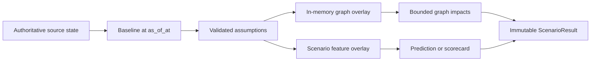
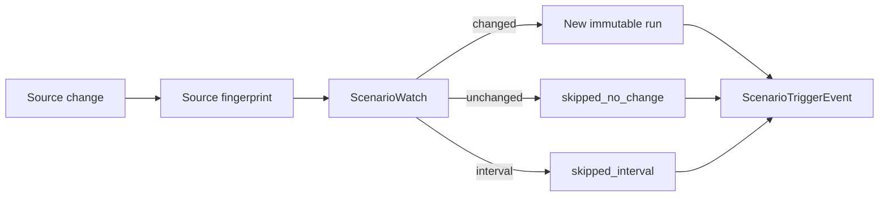

# Phase 3 Prompt 5 — Continuous Scenario Intelligence

## 1. Business purpose

Continuous Scenario Intelligence answers counterfactual delivery questions
under explicit assumptions: what changes in the Delivery Graph and prediction
estimate if an engineer is unavailable, capacity drops, a dependency slips, or
a deadline compresses. Results are decision-support estimates — not causal
proof, not guarantees, and not employee evaluations.

## 2. Scenario definition versus scenario version

- **ScenarioDefinition** — stable business identity (name, target, kind).
- **ScenarioVersion** — immutable assumption set. Changing assumptions always
  creates a new version; versions are never edited in place.

## 3. Supported scenario kinds

`engineer_unavailable`, `team_capacity_reduction`, `capability_unavailable`,
`repository_unavailable`, `dependency_delay`, `deadline_compression`,
`incident_escalation`, `combined` (max 10 non-recursive changes).

## 4. Assumption validation

Bounded payloads, forbidden secret/PII tokens, numeric bounds (e.g. delay
1–180 days, reduction 1–100%, compression 1–90 days), contradiction and
duplicate rejection, tenant-subject existence checks.

## 5. Source-of-truth separation

Scenario execution never mutates enterprise records, graph nodes/edges/findings,
evidence signals, prediction models, or historical predictions. Graph and feature
changes are overlays only. Baseline capture may materialize deterministic Prompt 4
feature snapshots via the shared extractor (idempotent by target/as_of/horizon);
existing snapshot values are not rewritten for simulation.

## 6. Overlay architecture

## 7. Baseline snapshots

Baseline and simulated evaluations share one `as_of_at`, horizon, source cutoff,
graph generation, and prediction/fallback mechanism. Baseline fingerprints
exclude scenario-version identity so alternative scenarios remain comparable.

## 8. Graph overlay

Loads a bounded relevant subgraph (depth ≤ 10, nodes ≤ 1000, edges ≤ 5000).
Applies assumptions in memory, recomputes reachability/blast radius/concentration
signals, and emits added/removed/worsened findings without writing graph tables.

## 9. Scenario feature overlays

Version `scenario_feature_overlay_v1`. Only documented features may change.
`training_eligible` is always false (DB check + service). Dataset builders must
not consume overlays. Values remain finite; lineage cites assumption rules.

## 10. Prediction integration

Only an **active** validated model may produce calibrated probability. Failed or
candidate Prompt 4 models are ignored. NovaBank normally uses the deterministic
scorecard (`uncalibrated_score`). Fallback score is **not** a probability.

## 11. Fallback behavior

When no active model exists: baseline and simulated both use
`delivery_scorecard_v1`. Probability fields stay null. Applicability warning
`uncalibrated_score_not_probability` is recorded.

## 12. Estimate comparability

`comparable_probability` | `comparable_score` | `incomparable_estimate_kind` |
`insufficient_data`. Numeric deltas exist only when both sides share the same
estimate kind.

## 13–15. Results, impacts, comparison

Immutable `ScenarioResult` / `ScenarioImpact` rows with deterministic hashes.
Comparison requires shared tenant/target/as_of/horizon/compatible baseline
fingerprint. Ordering uses an **explicit** dimension — no opaque aggregate score.

## 16–19. Fingerprints, watches, triggers, continuous re-evaluation

“Continuous” means source-change-aware re-evaluation via CLI
`scenario-evaluate-due` — not queues, workers, or real-time guarantees.
Minimum watch interval is 60 minutes. Failed evaluations do not advance
fingerprints. Previous results remain valid. Source fingerprints are
target-scoped (unrelated tenant ownership/evidence does not re-trigger) and
exclude wall-clock `as_of` from the aggregate hash so identical source state
does not appear changed solely because evaluation time moved.

## 20. Temporal semantics

Graph/evidence/readiness use active-at-time / at-or-before `as_of_at`
(`valid_from <= t < valid_to` for relationships where applicable). Scenario
assumptions are counterfactual and may extend beyond as_of; they never inject
future observed facts.

## 21–23. Tenant isolation, security, responsible use

Every operation requires `TenantContext`. Cross-tenant IDs return equivalent
not-found. Forbidden: credentials, emails, protected attributes, employee
rankings, blame language, causal claims. Outputs use wording such as
“This scenario increases ownership concentration.”

## 24. NovaBank scenarios

Eight deterministic synthetic scenarios (fraud engineer unavailable, platform
capacity, shared repo, dependency delay, Azure capability, incident escalation,
deadline compression, combined stress). Seed is idempotent.

## 25. Performance bounds

Max 10 changes, 50 subjects/change, graph depth 10, 1000 nodes, 5000 edges,
20 paths, 250 impacts, 100 watches/batch, 20 comparison runs.

A disposable SQLite harness seeds ≥500 nodes / ≥2,000 edges (cycles,
disconnected components, high-degree hubs) and asserts overlay/traversal/
impact budgets and a query-count ceiling. This is not a live PostgreSQL
scale proof and does not claim real-time processing.

## 26. Known limitations

No causal inference, no autonomous recommendations, no Prompt 6 AI Chief of
Staff, no background workers/queues, no real-time processing, no production
calibration claim, no authentication/RBAC/Entra/RLS, no OpenTelemetry export,
live PostgreSQL deferred unless tested.

## 27. Prompt 6 readiness

Prompt 5 provides immutable scenario results and impacts that a future AI Chief
of Staff could cite. Prompt 6 must not begin here.
