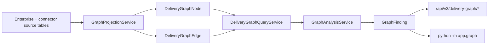
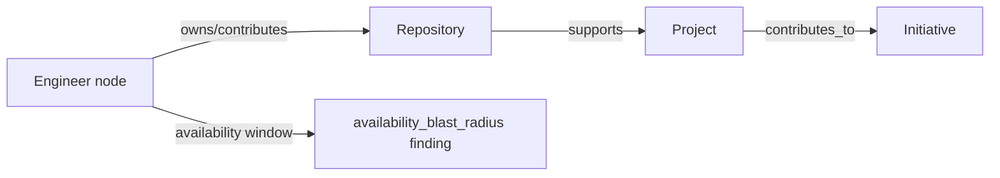

# Phase 3 Prompt 3 — Delivery Graph

## 1. Business purpose

The Delivery Graph is a **deterministic analytical model** that answers
engineering-execution questions with evidence-backed provenance:

- Which initiatives depend on one engineer?
- Which repositories have concentrated ownership?
- Which capabilities support critical initiatives?
- Which projects are affected by an engineer’s unavailability?
- Which cross-team dependencies are undocumented / unmodeled?
- Where is knowledge concentration highest?
- What is the delivery blast radius of a team, repository, or engineer?
- Why does SignalForge believe a dependency exists?

It is **not** a visualization feature, **not** a delivery-probability engine, and
**not** an LLM graph reasoner.

## 2. Relational graph architecture

SignalForge materializes the Delivery Graph as **tenant-scoped relational
projections** in PostgreSQL/SQLite tables:

| Table | Role |
| --- | --- |
| `ent_delivery_graph_nodes` | Projected entity nodes |
| `ent_delivery_graph_edges` | Temporal, provenance-aware edges |
| `ent_graph_projection_runs` | Projection run audit |
| `ent_graph_analysis_runs` | Analysis run audit |
| `ent_graph_findings` | Deterministic findings |
| `ent_graph_finding_evidence` | Finding ↔ evidence associations |

**Neo4j, Cosmos DB Gremlin, Apache AGE, and other graph databases are not used.**



## 3. Source-of-truth separation

Underlying Prompt 1 enterprise entities and Prompt 2 connector projections /
`EvidenceSignal` rows remain authoritative. Graph tables are rebuildable
projections. Rebuild does **not** drop graph tables; obsolete open edges are
temporally closed and orphan nodes may be archived.

## 4. Node model

Bounded `GraphNodeType` values: organization, business_unit, department, team,
engineer, initiative, project, capability, skill, repository, pull_request,
work_item, sprint, incident, deployment.

Deterministic `graph_node_id = build_entity_id("gnode", tenant, type, entity_id)`.
Tenant-qualified uniqueness on `(tenant_id, node_type, entity_id)`.
Display labels are bounded; no sensitive attributes, emails, credentials, or
raw evidence payloads.

## 5. Edge model

Bounded `GraphEdgeType` values: member_of, owns, contributes_to, reviews,
depends_on, supports, blocks, requires, deployed_by, responds_to,
transfers_knowledge_to.

Origins: `catalog`, `manual`, `connector`, `derived`.

Edges carry confidence (0–1), criticality, `valid_from`/`valid_to`,
provenance refs (`supporting_*`), optional `derivation_rule` /
`derivation_version`, bounded attributes, and `payload_hash`.

Self-edges and cross-tenant endpoints are rejected.

## 6. Edge provenance

| Origin | Provenance requirement |
| --- | --- |
| catalog / manual | Structural or ownership/dependency source id |
| connector | Evidence signal id (when available) |
| derived | `derivation_rule` + version; distinguishable from facts |

Derived edges are **not** described as confirmed manual facts.

## 7. Projection versions

`GRAPH_PROJECTION_VERSION = "1"`. Runs record mode, counters, sanitized errors,
and `source_high_watermark`.

## 8. Full rebuild

Tenant-scoped deterministic read of source entities → upsert nodes/edges →
close obsolete open edges → archive orphan nodes. Full rebuild claims a durable
`RUNNING` projection-run lock (visible to other sessions) before mutating the
graph; concurrent full rebuilds raise conflict. Graph mutations and the
terminal `SUCCEEDED` update commit together with the caller transaction.
Failures roll back uncommitted graph writes, record `FAILED`, and leave the
prior valid graph intact. Stale `RUNNING` locks older than 30 minutes are
ignored so abandoned runs cannot block rebuilds indefinitely.

## 9. Incremental refresh

Uses prior high-watermark minus a bounded overlap (`5 minutes`) with
**inclusive** `updated_at >= since` on **edge source rows** so equal timestamps
are not skipped. Nodes are always fully projected so endpoints remain
resolvable. Subject refresh projects all nodes but emits only edges incident to
the requested subject entity IDs (max 50). Watermark is the max observed source
`updated_at` (fallback: run start) and is written on the succeeded run record.
Removed relationships are closed on **full rebuild**, not on incremental /
subject refresh. Residual risk: HWM is time-only (no row-id tie-breaker); the
5-minute overlap plus idempotent upserts mitigate equal-timestamp races.

## 10. Connector integration

Preferred flow:

```text
GitHub → normalized event → EvidenceSignal → domain projection → graph subject refresh
```

Graph refresh is eventual relative to connector persistence. Connector
checkpoints are not rolled back when graph refresh fails. No distributed queue
is required in Prompt 3.

## 11. Query model

`DeliveryGraphQueryService` supports:

- neighbors (incoming/outgoing/both, filters, pagination)
- bounded shortest path
- reachability
- blast radius
- dependency cycles (canonical)
- ownership concentration
- summary + active-at-time filtering

## 12. Bounded traversal

Defaults: depth ≤ 6 (API max 20), node budget 500, edge budget 2000, path budget
20, operation budget 50_000. Iterative BFS/DFS only — no recursion-depth DoS,
no exponential all-path enumeration.

## 13. Blast-radius analysis



Returns direct/indirect affected nodes, initiatives, critical initiatives,
traversed edge ids, evidence ids, and bounded path explanations.
**No delivery probability.**

## 14. Ownership concentration

Deterministic score from primary owner / contributor counts and optional
allocations. Repository concentration focuses on **engineer** owners (team
catalog ownership is structural context). Does **not** use commit counts or
employee ranking.

## 15. Single-point-of-failure findings

`single_person_dependency` when a critical/high initiative effectively depends
on one engineer (via ownership and structural paths). Rule id + version always
returned.

## 16. Cross-team dependencies

Explicit cross-team dependency edges → `cross_team_dependency`.
Derived cross-team edges without an explicit dependency record →
`derived_unmodeled_dependency` (suppressed when an explicit record exists).

## 17. Dependency cycles

Directed cycles among depends_on/blocks/requires. Canonical rotation to the
lexicographically smallest node id; duplicate rotations collapsed.

## 18. Graph confidence

Rule-based evidence support (`GRAPH_CONFIDENCE_RULE_VERSION = "1"`).

**Not** Phase 2 assessment confidence. **Not** statistically calibrated.
**Not** a delivery probability.

## 19. Data-quality warnings

`stale_evidence`, `missing_owner`, `missing_team_mapping`,
`incomplete_capability_mapping`, `unresolved_actor_identity`,
`no_explicit_dependency_record`, `insufficient_history`.

## 20. Temporal graph semantics

Active-at-time uses half-open intervals: `valid_from <= t` and
(`valid_to` is null or `valid_to > t`), plus `archived_at` null or `> t`.
Material payload changes snapshot a closed historical edge row (`gedgehist_*`)
before updating the stable open edge id. Obsolete open edges closed on full
rebuild retain their row with `valid_to` / `archived_at` set. SQLite may
round-trip datetimes as naive UTC; services normalize to aware UTC before
comparison.

Limitation: Prompt 1/2 source history is incomplete for some entities; graph
history cannot invent missing source temporality.

## 21. Tenant isolation

Every repository/service/API/CLI operation requires `TenantContext`.
Cross-tenant node/edge/path/finding access returns non-disclosure `404`.
The `X-SignalForge-Tenant-ID` header is **development context, not
authentication**. No RBAC, Entra ID, or PostgreSQL RLS claim.

## 22. NovaBank scenarios

Additive seed coverage (idempotent):

1. Fraud-detection ownership concentration (Maya / fraud-scoring + fraud-modeling)
2. Payment-modernization → platform team/repo cross-team path
3. Azure-platform capability bottleneck with availability reduction (Gita)
4. Platform incident blast radius (`INC-PLATFORM-500` on payments-core-svc)
5. Demo dependency cycle (slo-platform ↔ payments-observability)

## 23. Performance bounds

Synthetic tests use ~500 nodes / ~2000 edges with cycles and hubs. Traversal
respects depth/node/edge/operation budgets. CI uses operation counts, not
fragile wall-clock thresholds.

## 24. Known limitations

- Relational projection only — not a production graph database
- Delivery probability is implemented separately in Prompt 4 — see
  [`phase-3-delivery-prediction.md`](phase-3-delivery-prediction.md);
  graph confidence is still **not** a delivery probability
- LLM graph queries **not implemented**
- Graph confidence is rule-based, not calibrated
- Authentication / RBAC / Entra ID / RLS deferred
- Queues / workers / OpenTelemetry export deferred
- Live PostgreSQL deferred unless explicitly validated
- Current graph data is synthetic / public / permissioned local evidence
- Employee-performance ranking is **not** implemented
- Findings are decision-support signals with provenance, not unverifiable facts

## 25. Prompt 4 prediction readiness

The graph provides versioned, evidence-backed structural inputs consumed by the
Delivery Prediction Engine (Prompt 4). See
[`phase-3-delivery-prediction.md`](phase-3-delivery-prediction.md). Prediction
must **not** mutate readiness/confidence semantics and must not treat graph
confidence as calibrated risk probability.

## API (read-only)

| Method | Path |
| --- | --- |
| GET | `/api/v3/delivery-graph/summary` |
| GET | `/api/v3/delivery-graph/nodes` |
| GET | `/api/v3/delivery-graph/nodes/{node_id}` |
| GET | `/api/v3/delivery-graph/nodes/{node_id}/neighbors` |
| GET | `/api/v3/delivery-graph/paths` |
| GET | `/api/v3/delivery-graph/blast-radius` |
| GET | `/api/v3/delivery-graph/dependency-cycles` |
| GET | `/api/v3/delivery-graph/ownership-concentration` |
| GET | `/api/v3/delivery-graph/findings` |
| GET | `/api/v3/delivery-graph/findings/{finding_id}` |
| GET | `/api/v3/delivery-graph/projection-runs` |
| GET | `/api/v3/delivery-graph/analysis-runs` |

No public rebuild endpoint (tenant header is not auth).

## CLI

```bash
python -m app.graph graph-rebuild --tenant-id novabank
python -m app.graph graph-analyze --tenant-id novabank
python -m app.graph graph-summary --tenant-id novabank
python -m app.graph graph-path --tenant-id novabank --source-node-id ... --target-node-id ...
python -m app.graph graph-blast-radius --tenant-id novabank --origin-node-id ...
python -m app.graph graph-list-findings --tenant-id novabank
python -m app.graph graph-validate --tenant-id novabank
python -m app.graph graph-refresh-subject --tenant-id novabank --subject-ids id1,id2
```

## Future metrics (not exported yet)

projection lag, node/edge counts, projection failures, finding counts,
traversal latency, stale-edge count, finding resolution rate.
