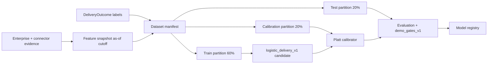
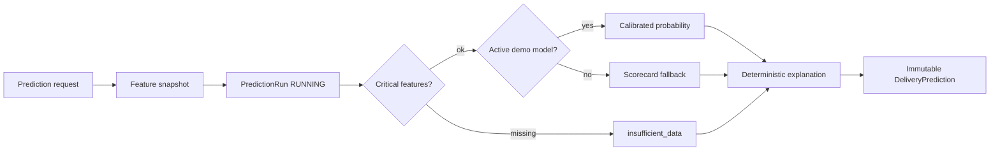

# Phase 3 Prompt 4 — Delivery Prediction Engine

## 1. Business purpose

The Delivery Prediction Engine answers a bounded leadership question with
**calibrated, evidence-backed delivery likelihood** for projects and initiatives:

- Given what we know **as of a cutoff**, how likely is delivery success within a
  fixed horizon?
- Which structural, readiness, ownership, and workflow factors drive that
  estimate?
- When history is too thin or a model is unavailable, what deterministic fallback
  (or honest `insufficient_data`) should operators see?

It is **decision support, not a guarantee**. It does **not** predict employee
performance, rank people, or produce LLM probabilities. Phase 2 readiness /
assessment confidence and Prompt 3 graph confidence remain **separate inputs** —
they are never redefined as calibrated delivery probability.



## 2. Prediction target (`DELIVERY_SUCCESS_WITHIN_HORIZON`)

| Constant | Value |
| --- | --- |
| `TARGET_DEFINITION` | `DELIVERY_SUCCESS_WITHIN_HORIZON` |
| Target types | `project`, `initiative` only |

Binary success means the target **delivers successfully within the observation
window** that starts at `prediction_cutoff_at` and ends at
`observation_window_end_at = cutoff + horizon_days`. Failure / cancel map to
label `0`. Unknown and censored outcomes stay unlabeled (see §5).

Employee-performance, team ranking, and people-surveillance targets are **not
represented** in the domain model.

## 3. Horizon definition

| Constant | Value |
| --- | --- |
| Supported horizons | `{30, 60, 90, 180}` days |
| Default | `90` |

Unsupported horizons are rejected at the API / domain boundary (`422`). Each
model, dataset manifest, evaluation, and prediction is horizon-scoped.

## 4. Outcome-label semantics (`delivery_success_label_v1`)

| Constant | Value |
| --- | --- |
| `LABEL_VERSION` | `delivery_success_label_v1` |

| `outcome_category` | Typical `binary_label` | Meaning |
| --- | --- | --- |
| `on_time_success` | `1` | Completed successfully on/before due, within horizon |
| `delayed_success` | `1` | Completed successfully after due but still within horizon window |
| `failed` | `0` | Missed delivery (no completion, or after window) |
| `cancelled` | `0` | Cancelled — no successful delivery |
| `unknown` | `null` | Not yet knowable / not verified |
| `censored` | `null` | Observation window incomplete or excluded |

Verified, finalized non-unknown/censored outcomes **require** a `0`/`1` label.
Verification statuses: `pending`, `verified`, `disputed`, `excluded`. Dataset
build only trains on verified labeled rows that pass leakage and sufficiency
checks.

## 5. Unknown and censored outcomes

- **Unknown** — outcome not yet observed or not verified; must remain unlabeled.
- **Censored** — horizon window incomplete, excluded, or otherwise unusable for
  supervision; must remain unlabeled.

Both are counted in manifests (`censored_rows`) and **excluded from training /
calibration / test labeled sets**. They must never appear as features (leakage).

## 6. Feature schema (`delivery_features_v1`, ~53 features)

| Constant | Value |
| --- | --- |
| `FEATURE_SCHEMA_VERSION` | `delivery_features_v1` |
| Feature count | **53** floats + per-feature `__missing` flags (model matrix ≈ 106 cols) |

| Family | Count | Examples |
| --- | --- | --- |
| A. Delivery readiness | 5 | `readiness_score_at_cutoff`, `assessment_confidence_at_cutoff`, capability coverage / gaps / critical risks |
| B. Delivery graph | 13 | dependency counts/depth/cycles, concentration & blast-radius findings, severity counts |
| C. Ownership / team resilience | 7 | engineer/team owners, redundancy, unavailable-owner ratio, availability |
| D. Workflow / delivery flow | 13 | work items, sprint completion, PRs, deployments (30d), incidents |
| E. Data quality / freshness | 8 | evidence age, source coverage, stale/missing indicators, graph projection age |
| F. Project context | 7 | criticality, planned duration, team/repo/capability counts, project age at cutoff |

Each `FeatureDefinition` carries allowed range, missing policy
(`zero` / `mean_train` / `flag_only`), transformation, source, leakage risk, and
human description. Forbidden privacy tokens (email, salary, protected attributes,
`employee_rank`, `performance_rating`, …) are rejected.

**Readiness ≠ probability. Assessment confidence ≠ probability. Graph confidence
≠ probability.** Those values may appear as features; they never become the
estimate kind `calibrated_probability`.

## 7. Feature lineage

`FeatureExtractor` builds **as-of** snapshots (`PredictionFeatureSnapshot`):

- Resolve tenant-scoped project/initiative
- Read Phase 2 assessment snapshots **read-only** (never recompute readiness)
- Pull graph findings/edges, ownership, workflow, data-source freshness, context
- Persist `feature_values`, `missingness_indicators`, bounded
  `feature_lineage[]` (≤ 64), `source_high_watermarks`,
  `evidence_cutoff_at ≤ as_of_at`, graph projection/analysis versions,
  `feature_hash`, data-quality warnings

Idempotent reuse for the same `(tenant, target, as_of, horizon, schema)`.

## 8. Leakage prevention

`PredictionLeakageValidator` rejects rows when:

- Outcome fields appear in features (`binary_label`, `outcome_category`,
  `actual_completed_at`, `probability_of_delivery_success`, …)
- Forbidden privacy tokens appear in feature names
- Evidence / lineage / source timestamps are **after** the prediction cutoff
- Post-cutoff resolution events are used as features
- Current (post-cutoff) graph state is used as if it were historical
- Test-set statistics are used for scaling/imputation, or calibrator is fit on test
- High leakage-risk features lack lineage

Unclean manifests refuse training. Leakage report hashes are stored on manifests.

## 9. Dataset manifests

`PredictionDatasetManifest` records:

- Versions: target, label, feature schema, horizon
- Counts: total / labeled / excluded / positive / negative / censored / feature /
  `tenant_count` (**always 1** — no cross-tenant training)
- Temporal bounds, split strategy, train/calibration/test row ids + hashes
- `leakage_report_hash`, `dataset_hash`, exclusion reasons, sufficiency report
- `data_scope` (`synthetic` / `public` / `customer_consented`)

Exclusion reasons include unverified/disputed/excluded/not finalized, censored/
unknown categories, missing label, and leakage.

## 10. Temporal split 60/20/20

| Constant | Value |
| --- | --- |
| `SPLIT_STRATEGY` | `temporal_60_20_20_grouped` |
| Train / calib / test | `0.60` / `0.20` / ~`0.20` |

Groups by `(target_type, target_id)`, ordered by earliest `prediction_cutoff_at`,
and assigns **whole groups** to one partition so the same target does not leak
across train/calib/test.

## 11. Deterministic baseline (`delivery_scorecard_v1`)

| Constant | Value |
| --- | --- |
| `SCORECARD_VERSION` | `delivery_scorecard_v1` |

Rule engine starts at risk score **50.0**, applies additive deltas from readiness,
confidence, coverage, gaps, cycles, findings, ownership, workflow, deployments,
incidents, and DQ indicators, then clamps to **[0, 100]**.

- Always `estimate_kind=uncalibrated_score` — **not a probability**
- Risk bands: low ≤25 / moderate ≤50 / high ≤75 / critical otherwise
- Top factors via scorecard rules (≤ 8 positive + 8 negative contributions)
- For metric comparison only: `baseline_pseudo_prob = 1 - score/100` (explicitly
  **not** a calibrated probability)

Used as fallback when no active validated model is available, and as the gate
baseline for Brier deltas.

## 12. Logistic model (`logistic_delivery_v1`)

| Constant | Value |
| --- | --- |
| `MODEL_NAME` | `logistic_delivery_v1` |
| `MODEL_TYPE` | `regularized_logistic_regression` |
| `TRAINING_CODE_VERSION` | `prediction_training_v1` |

**Pure Python** (`math_utils.fit_logistic_l2`) — **no numpy / sklearn**. L2-
regularized logistic regression (seed 42, L2=1.0, lr=0.1, max 500 iterations)
with train-only mean imputation and standardization.

Transparent `parameter_payload`: feature list, impute/scale stats, coefficients,
intercept, Platt slope/intercept, threshold version, schema/dataset hashes,
train positive rate, ranges, missing rates, model name/type.

New models start as `candidate`. Synthetic data forces `usage_scope=demo` and
`production_eligible=false`.

## 13. Probability calibration (Platt)

Platt scaling on the **calibration partition only**:

\[
P = \mathrm{sigmoid}(a \cdot \mathrm{logit}(p) + b)
\]

Degenerate single-class calibration → identity `(a=1, b=0)`. Inference uses
`predict_calibrated_proba`. Calibrator must never be fit on the final test set.

## 14. Evaluation metrics (Brier primary)

Primary metric: **Brier score**. Also reported: log loss, ECE, reliability bins,
ROC-AUC, average precision (when both classes present), confusion matrix @ 0.5,
and baseline Brier / log-loss.

`metrics_statistically_reliable` requires `row_count >= 30` **and**
`data_scope != synthetic`. Synthetic metrics are **demo-only** and must not be
claimed as real-world accuracy.

## 15. Brier score

Mean squared error between predicted probability and binary outcome:

\[
\mathrm{Brier} = \frac{1}{n}\sum_i (p_i - y_i)^2
\]

Lower is better. Demo gate: model Brier ≤ **0.35**, and
≤ baseline Brier + **0.05**.

## 16. Model registry

Lifecycle: train → evaluate → `mark_validated` (gates) → `promote(confirm=True)`
→ `active`; optional `retire`.

- One active model per `(tenant, target_definition, horizon, usage_scope)`
- Prior actives auto-retired on promote
- Synthetic → `DEMO`, `production_eligible=false` (DB constraint:
  `NOT (synthetic AND production_eligible)`)
- Concurrent promote conflicts surface as validation errors
- No public HTTP train/promote endpoints

## 17. Validation and promotion gates (`demo_gates_v1`)

| Constant | Value |
| --- | --- |
| `THRESHOLD_VERSION` | `demo_gates_v1` |

All must pass:

1. Manifest sufficiency (`MIN_LABELED_ROWS=60`, pos/neg ≥15, calib/test ≥10,
   leakage clean)
2. Both classes present
3. Probabilities finite in `[0, 1]`
4. Finite parameters; `|coef| ≤ 50`
5. Brier ≤ `GATE_MAX_BRIER` (0.35)
6. ECE ≤ `GATE_MAX_ECE` (0.25)
7. Brier ≤ baseline Brier + `GATE_MAX_BASELINE_BRIER_DELTA` (0.05)
8. Parameter hash integrity

These are **conservative demo gates**, not production thresholds.

## 18. Prediction inference



Flow:

1. Validate horizon / resolve target (tenant-scoped)
2. Extract feature snapshot
3. Create `PredictionRun`
4. Critical missing check (`readiness_score_at_cutoff`,
   `active_dependency_count`, `open_work_item_count`) may yield
   `insufficient_data`
5. Load active DEMO model for horizon + applicability / DQ warnings
6. Calibrated path **or** scorecard fallback
7. Persist immutable prediction (hash-deduped) + factors; complete run

API may return the latest matching prediction when `as_of` is omitted. Never
mutates Phase 2 assessments or graph projections.

## 19. Explanations

Deterministic templates — **no LLM**, **no person blame**:

- Logistic: top `MAX_FACTORS=8` by `|coef × normalized|`
  (`source_kind=logistic_contribution`)
- Scorecard: top rule contributions (`source_kind=scorecard_rule`)
- Summary text describes which factors raised/lowered the estimate

## 20. Fallback behavior

When no active validated model (or invalid payload) exists:

- Emit `estimate_kind=uncalibrated_score`
- Use `delivery_scorecard_v1` risk score + risk band
- Attach `baseline_fallback` (and related) data-quality warnings
- Still return deterministic factors

Fallback is **not** a calibrated probability and must not be labeled as one.

## 21. Insufficient-data behavior

When the target cannot be resolved, the horizon is invalid, or critical features
are missing:

- `estimate_kind=insufficient_data`
- No numeric probability or risk score presented as a probability
- `applicability=not_applicable`; conservative risk-band presentation
- Honest messaging that history / features are insufficient

## 22. Applicability warnings

| Applicability | Meaning |
| --- | --- |
| `applicable` | Estimate usable under stated reliability |
| `degraded` | Usable with warnings (stale / limited / OOD) |
| `not_applicable` | Do not treat as a usable probability |

Reliability statuses include `validated`, `limited`, `insufficient_history`,
`stale_data`, `out_of_distribution`, `model_unavailable`. Synthetic active models
are capped at **limited** reliability. Applicability is a basic OOD / DQ check —
not a full drift platform.

## 23. Backtesting

`PredictionBacktestService`: rolling-origin temporal folds
(`MAX_BACKTEST_FOLDS=8`). Small histories degrade to a single 60/20/20 fold with
an explicit `single_fold_limitation` note. Aggregates mean Brier / ECE / etc.
Synthetic scope is always noted — **synthetic metrics ≠ real-world accuracy**.

## 24. Tenant isolation

- Every repository / service / API / CLI path requires `TenantContext`
- Manifests enforce `tenant_count=1` — **no cross-tenant training**
- Wrong-tenant access → non-disclosure `404` / empty lists
- `X-SignalForge-Tenant-ID` is **development context, not authentication**
- No RBAC, Entra ID, or PostgreSQL RLS claim in Prompt 4

## 25. Synthetic NovaBank validation

Idempotent `prediction_seed` (CLI `seed-outcomes`, NovaBank only):

- Epoch `2024-01-01`, horizon 90
- 8 projects × 8 cutoffs + 5 initiatives × 8 cutoffs → **104** outcomes
- Labels from hash + mild flip (~55/45) — **not** derived from the scorecard
  (intentionally imperfect metrics)
- ~10% censored / unknown / excluded; rest verified with binary labels
- `data_scope=synthetic` → models `production_eligible=false`, demo usage only

## 26. Security and privacy

- Forbidden feature tokens block PII / sensitive attributes / credentials /
  performance-ranking fields
- Feature snapshots and predictions store bounded, hashed, lineage-capped
  payloads — not raw evidence dumps
- CLI omits coefficient binary dumps
- Cross-tenant feature / model leakage is rejected at the data boundary
- Live PostgreSQL remains **deferred** unless explicitly validated
- Predictions are decision-support; they are not contractual guarantees

## 27. Employee-surveillance prohibition

Employee-performance prediction, ranking, manager-sentiment scoring, and
people-surveillance features are **not implemented** and must not be added under
this target definition. Explanations must not blame individuals. Ownership /
availability features describe delivery structure, not personal performance.

## 28. Known limitations

- Synthetic NovaBank metrics are **demo-only** — not statistically reliable for
  real-world accuracy claims; `production_eligible=false`
- On the audited NovaBank synthetic run, `demo_gates_v1` **failed** (ECE and/or
  ranking metrics are weak); the candidate remains **unpromoted** /
  non-active. Scorecard fallback is the default inference path until a
  validated active model exists.
- Synthetic ROC-AUC on the held-out test partition is poor and must not be
  marketed as predictive power
- Grouped temporal split (`temporal_60_20_20_grouped`) assigns whole
  `(target_type, target_id)` groups by earliest cutoff. Individual row
  cutoffs may therefore overlap across partitions; cross-partition leakage is
  prevented by the grouping key (no shared target across train/cal/test), not
  by a strict global cutoff barrier on every row
- Small history → single-fold backtest limitation
- Applicability / OOD checks are basic, not a drift platform
- Scorecard pseudo-probability is for metric comparison only
- Pure-Python logistic is transparent MVP — not a production ML platform
- Coefficients are **not causal** feature importance
- `project_criticality_score` / `initiative_criticality_score` read current
  entity criticality (no temporal criticality history in Prompt 1 schema);
  work-item completion, source freshness, and capability requirements are
  as-of filtered by timestamps / `created_at`
- Phase 2 `Assessment` rows lack `tenant_id`; readiness joins are by
  `project_id` only (legacy schema limitation)
- No continuous / streaming scenarios (Prompt 5 — **not implemented**)
- No LLM probabilities; no auth / RBAC / Entra ID / RLS
- Tenant header is not authentication
- Live PostgreSQL deferred unless explicitly validated
- No public HTTP endpoints for train / evaluate / promote
- Predictions do not mutate readiness, assessment confidence, or graph confidence
  semantics
- No post-finalize outcome correction workflow (finalized labels are immutable;
  disputed status exists but amend/correct is deferred)

## 29. Prompt 5 readiness (do not implement Prompt 5)

Prompt 4 leaves versioned, tenant-scoped feature snapshots, immutable
predictions, model registry, and calibrated estimates suitable for a future
**Continuous Scenario Intelligence** milestone (incremental recompute, scenario
templates, change notifications). Prompt 5 must:

- Consume predictions as inputs — not recompute LLM probabilities
- Preserve estimate-kind distinctions and synthetic `production_eligible=false`
- Not mutate Phase 2 readiness / confidence or Prompt 3 graph confidence
- Remain tenant-scoped with no cross-tenant scenario leakage

**Prompt 5 is not implemented in this milestone.**

## Distinctions (summary)

| Concept | Rule |
| --- | --- |
| Calibrated probability | Only from validated logistic + Platt; `estimate_kind=calibrated_probability` |
| Uncalibrated score | Scorecard 0–100 risk; **not** a probability |
| Insufficient data | No usable numeric probability |
| Readiness | Input feature only — ≠ probability |
| Assessment confidence | Separate Phase 2 score — ≠ probability |
| Graph confidence | Rule-based Prompt 3 score — ≠ probability |
| Synthetic metrics | Demo only — ≠ real-world accuracy |
| Synthetic models | `production_eligible=false`, usage `demo` |
| Cross-tenant training | Forbidden (`tenant_count=1`) |
| LLM probabilities | Never |
| Auth / RBAC | Not in scope; tenant header ≠ authentication |
| Live PostgreSQL | Deferred |
| Predictions | Decision-support, not guarantees |
| Employee performance prediction | Not implemented |

## Persistence (Alembic `p3_delivery_prediction`)

| Table | Role |
| --- | --- |
| `ent_delivery_outcomes` | Labeled / censored delivery outcomes |
| `ent_prediction_feature_snapshots` | As-of feature snapshots + lineage |
| `ent_prediction_dataset_manifests` | Temporal dataset manifests |
| `ent_prediction_models` | Model registry + parameter payloads |
| `ent_prediction_model_evaluations` | Hold-out / gate evaluations |
| `ent_prediction_runs` | Inference run audit |
| `ent_delivery_predictions` | Immutable predictions |
| `ent_prediction_factors` | Explanation factors (rank 1–8) |

## API (read-only)

Prefix: `/api/v3/predictions`. Requires `X-SignalForge-Tenant-ID`. **No** public
train / promote endpoints.

| Method | Path | Purpose |
| --- | --- | --- |
| GET | `/api/v3/predictions/projects/{project_id}` | Latest or run project prediction (`horizon_days`, `as_of`) |
| GET | `/api/v3/predictions/projects/{project_id}/history` | Paginated project prediction history |
| GET | `/api/v3/predictions/initiatives/{initiative_id}` | Latest or run initiative prediction |
| GET | `/api/v3/predictions/initiatives/{initiative_id}/history` | Paginated initiative history |
| GET | `/api/v3/predictions/models` | List models (optional `horizon_days`) |
| GET | `/api/v3/predictions/models/{model_id}` | Get model |
| GET | `/api/v3/predictions/models/{model_id}/evaluation` | Evaluations for a model |
| GET | `/api/v3/predictions/evaluations` | List evaluations |
| GET | `/api/v3/predictions/runs` | List runs (optional target filters) |
| GET | `/api/v3/predictions/data-health` | Labeled-data sufficiency health |
| GET | `/api/v3/predictions/outcomes` | List delivery outcomes |

Pagination: `limit` 1–100 (default 20), `offset ≥ 0`.

## CLI

```bash
python -m app.prediction build-dataset --tenant-id novabank --horizon-days 90
python -m app.prediction train --tenant-id novabank --manifest-id ... [--seed 42]
python -m app.prediction evaluate --tenant-id novabank --model-id ...
python -m app.prediction promote --tenant-id novabank --model-id ... --confirm
python -m app.prediction retire --tenant-id novabank --model-id ...
python -m app.prediction predict --tenant-id novabank --target-type project --target-id ... [--horizon-days 90] [--as-of ...]
python -m app.prediction backtest --tenant-id novabank --horizon-days 90
python -m app.prediction list-models --tenant-id novabank [--limit 50]
python -m app.prediction list-evaluations --tenant-id novabank [--model-id ...] [--limit 50]
python -m app.prediction data-health --tenant-id novabank
python -m app.prediction validate --tenant-id novabank
python -m app.prediction seed-outcomes --tenant-id novabank
```

JSON on stdout; synthetic-scope banner when applicable. Promote requires explicit
`--confirm`. `seed-outcomes` is restricted to the NovaBank tenant.

## Key modules

| Path | Role |
| --- | --- |
| `backend/app/domain/prediction_constants.py` | Versioned constants / gates |
| `backend/app/domain/prediction_enums.py` | Bounded enums |
| `backend/app/domain/prediction_models.py` | Pydantic DTOs |
| `backend/app/services/prediction/` | Schema, extract, leakage, dataset, baseline, train, calibrate, evaluate, registry, inference, explanations, applicability, backtest, orchestration |
| `backend/app/api/v3/predictions.py` | Read-only HTTP |
| `backend/app/prediction/cli.py` | `python -m app.prediction` |
| `backend/app/db/models/prediction.py` | ORM |
| `backend/app/db/prediction_seed.py` | NovaBank synthetic outcomes |
| `backend/alembic/versions/p3_delivery_prediction.py` | Migration |
| `backend/tests/prediction/` | Test suite |
